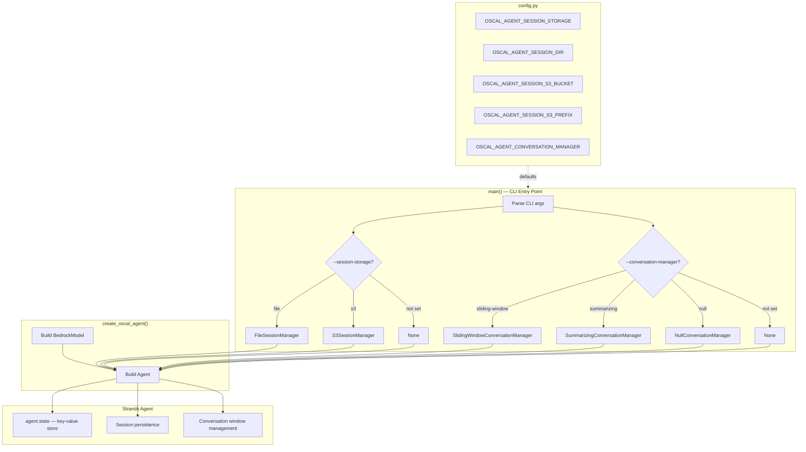

# Design Document: Agent Session State

## Overview

This feature adds session persistence, conversation management, and agent state to the standalone OSCAL agent (`oscal_agent.py`). The Strands SDK already ships `FileSessionManager`, `S3SessionManager`, `SlidingWindowConversationManager`, `SummarizingConversationManager`, `NullConversationManager`, and `agent.state`. This design wires those capabilities into the existing agent factory and CLI entry point so that conversation history and user context survive across invocations. The MCP server (`main.py`) is completely unaffected.

### Design Decisions

1. **No new dependencies** — everything comes from `strands-agents>=1.19.0`, already in `pyproject.toml`.
2. **Backward-compatible factory** — new parameters on `create_oscal_agent()` default to `None`, preserving existing behavior for all current callers.
3. **CLI-only wiring** — session/conversation manager instantiation happens in `main()`, not in the factory. The factory accepts pre-built manager instances.
4. **Environment variables as defaults, CLI as overrides** — follows the existing pattern in `config.py` where env vars set defaults and CLI args take precedence.
5. **Session ID auto-generation** — when session storage is enabled but no `--session-id` is given, a UUID v4 is generated and logged so the operator can resume later.

## Architecture



### Data Flow

1. `config.py` reads session/conversation env vars at import time (singleton).
2. `main()` parses CLI args; CLI values override config defaults.
3. `main()` instantiates the appropriate session manager and conversation manager (or `None`).
4. `main()` calls `create_oscal_agent(session_manager=..., conversation_manager=...)`.
5. `create_oscal_agent()` passes them through to `Agent(...)`.
6. The Strands SDK handles persistence and window management transparently.

### MCP Server Isolation

`main.py` (MCP server) does not import any session or conversation manager classes. It calls neither `create_oscal_agent()` nor any session-related code. This isolation is maintained by keeping all session wiring inside `oscal_agent.py:main()`.

## Components and Interfaces

### 1. `config.py` — New Attributes

```python
class Config:
    # ... existing attributes ...

    # Session management
    session_storage: str        # "" | "file" | "s3"
    session_dir: str            # default ".oscal_sessions"
    session_s3_bucket: str      # default ""
    session_s3_prefix: str      # default "oscal-agent-sessions/"

    # Conversation management
    conversation_manager_type: str  # "" | "sliding-window" | "summarizing" | "null"
```

These are read from environment variables in `__init__` following the existing pattern:

| Attribute                  | Env Var                            | Default                    |
|----------------------------|------------------------------------|----------------------------|
| `session_storage`          | `OSCAL_AGENT_SESSION_STORAGE`      | `""` (disabled)            |
| `session_dir`              | `OSCAL_AGENT_SESSION_DIR`          | `".oscal_sessions"`        |
| `session_s3_bucket`        | `OSCAL_AGENT_SESSION_S3_BUCKET`    | `""`                       |
| `session_s3_prefix`        | `OSCAL_AGENT_SESSION_S3_PREFIX`    | `"oscal-agent-sessions/"`  |
| `conversation_manager_type`| `OSCAL_AGENT_CONVERSATION_MANAGER` | `""` (SDK default)         |

### 2. `create_oscal_agent()` — Extended Signature

```python
def create_oscal_agent(
    tools: list[Any] | None = None,
    callback_handler: Any = "default",
    session_manager: Any | None = None,          # NEW
    conversation_manager: Any | None = None,     # NEW
) -> Agent:
```

When `session_manager` is not `None`, it is passed as `session_manager=session_manager` in the `Agent(...)` constructor kwargs. Same for `conversation_manager`. When `None`, the key is omitted from kwargs entirely, preserving the SDK's default behavior.

### 3. `main()` — New CLI Arguments

| Argument                  | Type   | Default       | Description                                      |
|---------------------------|--------|---------------|--------------------------------------------------|
| `--session-id`            | `str`  | (auto UUID)   | Session ID for resume                            |
| `--session-storage`       | choice | (from config) | `file` or `s3`                                   |
| `--session-dir`           | `str`  | (from config) | Local dir for FileSessionManager                 |
| `--session-s3-bucket`     | `str`  | (from config) | S3 bucket for S3SessionManager                   |
| `--session-s3-prefix`     | `str`  | (from config) | S3 key prefix for S3SessionManager               |
| `--conversation-manager`  | choice | (from config) | `sliding-window`, `summarizing`, or `null`       |

### 4. Session Manager Construction (in `main()`)

```python
def _build_session_manager(args, config) -> Any | None:
    storage = args.session_storage or config.session_storage
    if not storage:
        return None

    session_id = args.session_id or str(uuid.uuid4())

    if storage == "file":
        session_dir = args.session_dir or config.session_dir
        return FileSessionManager(
            session_id=session_id,
            storage_dir=session_dir,
        )
    elif storage == "s3":
        bucket = args.session_s3_bucket or config.session_s3_bucket
        if not bucket:
            logger.error("--session-s3-bucket is required when --session-storage=s3")
            raise SystemExit(1)
        prefix = args.session_s3_prefix or config.session_s3_prefix
        return S3SessionManager(
            session_id=session_id,
            bucket_name=bucket,
            key_prefix=prefix,
        )
```

### 5. Conversation Manager Construction (in `main()`)

```python
def _build_conversation_manager(args, config) -> Any | None:
    cm_type = args.conversation_manager or config.conversation_manager_type
    if not cm_type:
        return None

    if cm_type == "sliding-window":
        return SlidingWindowConversationManager()
    elif cm_type == "summarizing":
        return SummarizingConversationManager()
    elif cm_type == "null":
        return NullConversationManager()
```

### 6. Session ID Logging (in `main()`)

```python
# After building session manager, before entering loop:
if session_manager is not None:
    if args.query:
        logger.debug("Session ID: %s", session_id)
    else:
        logger.info("Session ID: %s", session_id)
        print(f"Session ID: {session_id}")  # human-readable for interactive mode
```

## Data Models

### Session State (managed by Strands SDK)

The Strands SDK persists two things via the session manager:

1. **Conversation history** — the list of messages exchanged between user and agent.
2. **Agent state** (`agent.state`) — a JSON-serializable `dict[str, Any]` key-value store accessible from tools via `ToolContext`.

No custom data models are needed. The SDK handles serialization/deserialization internally.

### Configuration Model (additions to `Config`)

```python
# New attributes on the Config singleton — all strings, parsed from env vars
session_storage: str            # "" | "file" | "s3"
session_dir: str                # filesystem path
session_s3_bucket: str          # S3 bucket name
session_s3_prefix: str          # S3 key prefix
conversation_manager_type: str  # "" | "sliding-window" | "summarizing" | "null"
```

### CLI Argument Namespace (additions)

```python
# argparse adds these to the args namespace
args.session_id: str | None
args.session_storage: str | None       # "file" | "s3" | None
args.session_dir: str | None
args.session_s3_bucket: str | None
args.session_s3_prefix: str | None
args.conversation_manager: str | None  # "sliding-window" | "summarizing" | "null" | None
```


## Correctness Properties

*A property is a characteristic or behavior that should hold true across all valid executions of a system — essentially, a formal statement about what the system should do. Properties serve as the bridge between human-readable specifications and machine-verifiable correctness guarantees.*

### Property 1: Factory Manager Forwarding

*For any* non-None session manager or conversation manager object passed to `create_oscal_agent()`, the `Agent` constructor SHALL be called with that exact object as the corresponding keyword argument. When `None` is passed (or the parameter is omitted), the corresponding keyword argument SHALL be absent from the `Agent` constructor call.

**Validates: Requirements 1.1, 1.2, 2.1, 2.2**

### Property 2: Session/Conversation Config Environment Variable Parsing

*For any* valid value of the session and conversation configuration environment variables (`OSCAL_AGENT_SESSION_STORAGE`, `OSCAL_AGENT_SESSION_DIR`, `OSCAL_AGENT_SESSION_S3_BUCKET`, `OSCAL_AGENT_SESSION_S3_PREFIX`, `OSCAL_AGENT_CONVERSATION_MANAGER`), constructing a `Config` instance SHALL yield attributes that exactly match the environment variable values.

**Validates: Requirements 7.1, 7.2, 7.3, 7.4, 7.5**

### Property 3: CLI Precedence Over Environment Variables

*For any* pair of (env_var_value, cli_arg_value) for session storage, session directory, S3 bucket, S3 prefix, or conversation manager type, when both are set, the effective value used to construct the session/conversation manager SHALL equal the CLI argument value, not the environment variable value.

**Validates: Requirements 7.6**

### Property 4: Session ID Propagation

*For any* valid session ID string provided via `--session-id`, the session manager constructed by `main()` SHALL receive that exact string as its session ID. When no `--session-id` is provided and session storage is enabled, the generated session ID SHALL be a valid UUID v4 string.

**Validates: Requirements 3.2, 3.3**

## Error Handling

| Scenario | Behavior | Exit Code |
|---|---|---|
| `--session-storage=s3` without `--session-s3-bucket` | Log descriptive error, exit | 1 |
| `FileSessionManager` creation fails (e.g., unwritable dir) | Log error, exit | 1 |
| `S3SessionManager` creation fails (e.g., bad credentials) | Log error, exit | 1 |
| Invalid `--session-storage` value | `argparse` rejects with usage message | 2 (argparse default) |
| Invalid `--conversation-manager` value | `argparse` rejects with usage message | 2 (argparse default) |
| Session restore fails (corrupted data) | Strands SDK handles; agent starts fresh session | N/A |

Error handling follows the existing pattern in `main()`: catch exceptions from manager construction, log at ERROR level, and raise `SystemExit` with an appropriate code. The `argparse` `choices` parameter handles invalid enum values automatically.

## Testing Strategy

### Unit Tests (example-based)

Unit tests cover specific scenarios and edge cases using `pytest` with `unittest.mock`:

- **Factory backward compatibility** (Req 1.2, 2.2, 8.3): `create_oscal_agent()` with no new args produces Agent kwargs without `session_manager` or `conversation_manager`.
- **CLI argument parsing** (Req 3.1, 4.1, 4.5–4.7, 5.1): Each new CLI arg is parsed correctly.
- **Session manager construction** (Req 4.2, 4.3, 4.4): `--session-storage=file` creates `FileSessionManager`, `--session-storage=s3` creates `S3SessionManager`, omitted creates `None`.
- **Conversation manager construction** (Req 5.2–5.5): Each `--conversation-manager` value creates the correct manager type.
- **S3 bucket validation** (Req 4.8): `--session-storage=s3` without `--session-s3-bucket` exits with code 1.
- **Session ID auto-generation** (Req 3.3): When `--session-id` is omitted with session storage enabled, a UUID v4 is generated and logged at INFO.
- **Session ID logging** (Req 9.1–9.4): Interactive mode logs at INFO and prints to stdout; single-query mode logs at DEBUG and does not print.
- **MCP server isolation** (Req 8.1): `main.py` source does not contain session/conversation manager imports.
- **Config defaults** (Req 7.1–7.5): Config attributes have correct defaults when env vars are unset.

### Property-Based Tests (Hypothesis)

Property-based tests use `hypothesis` (already a dev dependency) with minimum 100 iterations per property:

- **Property 1: Factory manager forwarding** — Generate random mock objects for `session_manager` and `conversation_manager`, verify `Agent()` receives them. Tag: `Feature: agent-session-state, Property 1: Factory manager forwarding`
- **Property 2: Config env var parsing** — Generate random valid strings for each session/conversation env var, construct `Config`, verify attributes match. Tag: `Feature: agent-session-state, Property 2: Session/conversation config env var parsing`
- **Property 3: CLI precedence** — Generate random (env, cli) value pairs, verify CLI wins. Tag: `Feature: agent-session-state, Property 3: CLI precedence over env vars`
- **Property 4: Session ID propagation** — Generate random session ID strings, verify they flow to the session manager constructor. Tag: `Feature: agent-session-state, Property 4: Session ID propagation`

### Integration Tests

Integration tests (marked `@pytest.mark.integration`) verify end-to-end behavior with real Strands SDK classes:

- **Req 6.1–6.4**: Create agent with `FileSessionManager` in a temp directory, set `agent.state` values, verify persistence and restoration across sessions.

### Test File Organization

Following the existing project convention:

- `tests/test_oscal_agent.py` — extend with new unit tests and property tests for factory and CLI changes
- `tests/test_config.py` — extend with new unit tests and property tests for config env var parsing
- `tests/test_integration.py` — extend with session persistence integration tests
