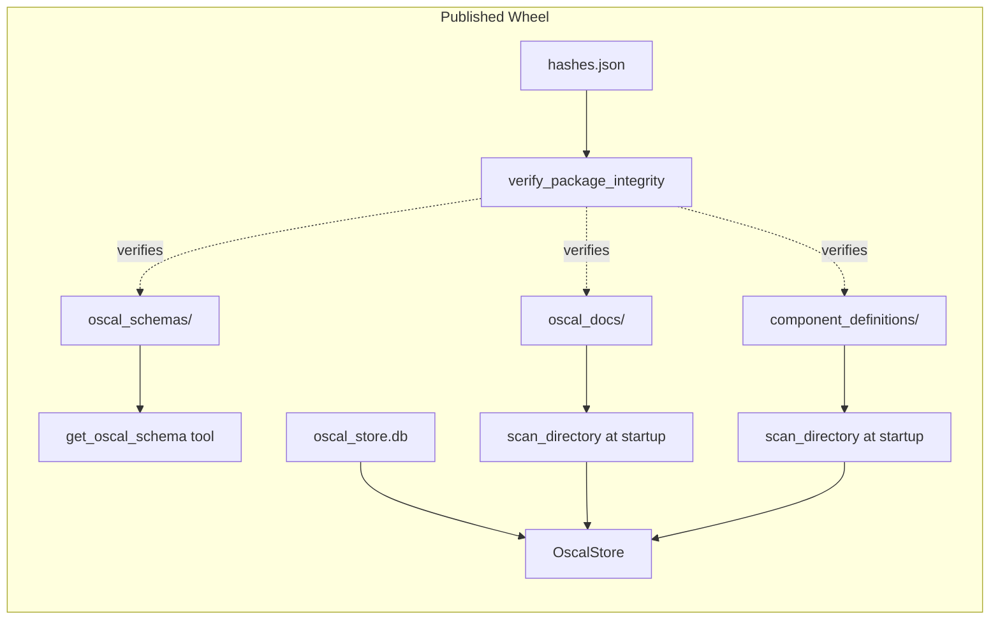
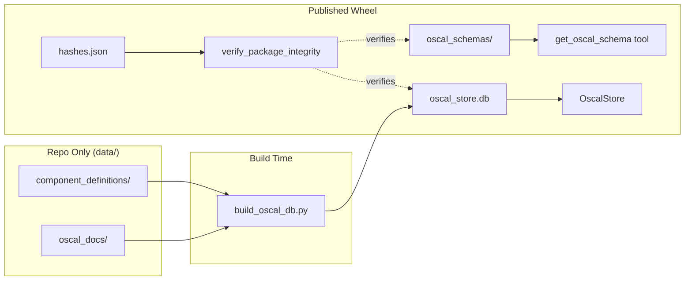

# Design Document: Drop Bundled Raw Content

## Overview

This feature restructures the `mcp-server-for-oscal` package to stop bundling raw content directories (`oscal_docs/` and `component_definitions/`) inside the published wheel. These directories are only needed at build time by `bin/build_oscal_db.py` to produce `oscal_store.db`. At runtime, the pre-built database is the sole source of indexed content.

The change involves:
1. Moving `oscal_docs/` and `component_definitions/` from `src/mcp_server_for_oscal/` to a top-level `data/` directory.
2. Updating `pyproject.toml` packaging config to exclude `data/` from the wheel (but keep it in the sdist).
3. Removing startup code that scans or integrity-verifies these directories.
4. Updating the build script to read from `data/` paths.
5. Updating the rehash script to stop generating manifests for removed directories.
6. Ensuring the server starts cleanly from the bundled DB alone.

`oscal_schemas/` and `oscal_store.db` remain inside the package — schemas are served directly at runtime by `get_oscal_schema`, and the DB is resolved via `__file__`-relative paths.

## Architecture

### Current State



### Target State



### Repository Layout Change

```
Before:                                  After:
src/mcp_server_for_oscal/               data/
  oscal_docs/          (bundled)           oscal_docs/          (build-time only)
  component_definitions/ (bundled)         component_definitions/ (build-time only)
  oscal_schemas/       (bundled)         src/mcp_server_for_oscal/
  oscal_store.db       (bundled)           oscal_schemas/       (bundled)
  hashes.json          (bundled)           oscal_store.db       (bundled)
                                           hashes.json          (bundled)
```

## Components and Interfaces

### 1. File System Changes

Move two directories:
- `src/mcp_server_for_oscal/oscal_docs/` → `data/oscal_docs/`
- `src/mcp_server_for_oscal/component_definitions/` → `data/component_definitions/`

No changes to:
- `src/mcp_server_for_oscal/oscal_schemas/` (stays in package)
- `src/mcp_server_for_oscal/oscal_store.db` (stays in package)
- `src/mcp_server_for_oscal/hashes.json` (stays in package, records DB hash)

### 2. `pyproject.toml` — Packaging Config

The `[tool.hatch.build.targets.wheel]` section already specifies `packages = ["src/mcp_server_for_oscal"]` and `artifacts = ["src/mcp_server_for_oscal/oscal_store.db"]`. Since the directories are being moved out of `src/`, they are automatically excluded from the wheel. No explicit exclude rules are needed for the wheel target.

For the sdist, `data/` should be included so source builds can regenerate the DB. Hatch includes all tracked files by default, so no sdist config change is needed as long as `data/` is committed to git.

### 3. `pyproject.toml` — Rehash Script

Current rehash script regenerates hashes for `oscal_schemas/`, `oscal_docs/`, and `component_definitions/`. The updated script removes the `oscal_docs` and `component_definitions` lines:

```toml
rehash = [
  "hatch run bin/update_hashes.py src/mcp_server_for_oscal/oscal_schemas",
  "git add src/mcp_server_for_oscal/oscal_schemas/hashes.json",
  "git add src/mcp_server_for_oscal/hashes.json"
]
```

### 4. `main.py` — Startup Code Changes

**`main()` function — integrity verification block:**
- Remove `verify_package_integrity` calls for `oscal_docs` and `component_definitions`.
- Keep `verify_package_integrity` call for `oscal_schemas`.
- Remove the conditional check for `component_definitions_dir`.

**`_init_oscal_store()` function:**
- Remove the `scan_directory` call for `comp_defs_dir` (component definitions).
- Remove the `scan_directory` call for `bundled_docs_dir` (oscal_docs).
- Keep the user-configured `oscal_documents_dir` scanning (external directory).
- Add a warning log if user-configured `oscal_documents_dir` doesn't exist.

### 5. `oscal_agent.py` — Startup Code Changes

**`main()` function — integrity verification block:**
- Remove `verify_package_integrity` calls for `oscal_docs` and `component_definitions`.
- Keep `verify_package_integrity` call for `oscal_schemas`.
- Remove the conditional check for `component_definitions_dir`.

### 6. `bin/build_oscal_db.py` — Build Script Changes

Update path constants to point to `data/`:
- `COMPONENT_DEFS_DIR`: `REPO_ROOT / "data" / "component_definitions"`
- `OSCAL_DOCS_DIR`: `REPO_ROOT / "data" / "oscal_docs"`

The `build_db()` function already accepts these as parameters and handles missing directories gracefully, so the core logic is unchanged.

### 7. `config.py` — Configuration

The `component_definitions_dir` config setting becomes irrelevant for bundled content since the directory no longer exists in the package. However, removing it would be a breaking change for users who have set `OSCAL_COMPONENT_DEFINITIONS_DIR`. The setting will be left in place but the startup code will no longer use it for scanning bundled content.

## Data Models

No data model changes. The `oscal_store.db` schema, `hashes.json` manifest format, and all OSCAL model types remain unchanged.

The only structural change is the file system layout — moving directories from the package tree to the repository root `data/` directory.

## Error Handling

### Startup Error Handling (main.py and oscal_agent.py)

1. **oscal_schemas integrity failure**: If `verify_package_integrity(oscal_schemas)` raises `RuntimeError` or `KeyError`, log the exception and exit with status code 2. This behavior is unchanged.

2. **Missing raw content directories**: No error. The startup code simply does not attempt to scan or verify `oscal_docs/` or `component_definitions/`. Their absence is the expected state in a published package.

3. **User-configured oscal_documents_dir does not exist**: Log a warning and continue startup. Do not raise an exception — the user may have misconfigured the path, but the server should still start with the bundled DB.

4. **Bundled DB missing or corrupt**: Handled by `OscalStore._resolve_auto()` — falls back to ephemeral DB with a warning log. No change to this behavior.

### Build Script Error Handling (build_oscal_db.py)

1. **Missing data/ directories**: Already handled — `build_db()` checks `exists()` before scanning and logs an informational skip message. The path constants change but the logic is identical.

2. **Empty data/ directories**: Already handled — `build_db()` produces a DB with 0 documents, which is valid.

### Rehash Script Error Handling

The rehash script is a sequence of shell commands. Removing the `oscal_docs` and `component_definitions` lines eliminates the possibility of those commands failing due to missing directories.

## Testing Strategy

### Why Property-Based Testing Does Not Apply

This feature involves file system restructuring, configuration changes, and removal of code paths. There are no pure functions with meaningful input variation, no serialization/parsing logic, and no algorithms that would benefit from property-based testing. All acceptance criteria fall into SMOKE, EXAMPLE, or INTEGRATION categories.

### Unit Tests

**Startup integrity verification (main.py):**
- `verify_package_integrity` is called exactly once, for `oscal_schemas/` only.
- `verify_package_integrity` is NOT called for `oscal_docs/` or `component_definitions/`.
- `RuntimeError` from `oscal_schemas` verification causes `SystemExit(2)`.

**Startup integrity verification (oscal_agent.py):**
- Same assertions as main.py — only `oscal_schemas/` is verified.

**Startup store initialization (_init_oscal_store):**
- `scan_directory` is NOT called for bundled `component_definitions/` or `oscal_docs/`.
- When `oscal_documents_dir` is configured and exists, `scan_directory` IS called for it.
- When `oscal_documents_dir` is configured but doesn't exist, a warning is logged and startup continues.
- `OscalStore` is still initialized from the bundled DB.

**Build script path constants:**
- `COMPONENT_DEFS_DIR` points to `REPO_ROOT / "data" / "component_definitions"`.
- `OSCAL_DOCS_DIR` points to `REPO_ROOT / "data" / "oscal_docs"`.
- `build_db()` with test content at `data/` paths produces indexed documents.

**Rehash script configuration:**
- `pyproject.toml` rehash commands do not reference `oscal_docs` or `component_definitions`.
- `pyproject.toml` rehash commands still reference `oscal_schemas` and stage `hashes.json`.

### Integration Tests

**Startup without raw content:**
- Server starts successfully when `oscal_docs/` and `component_definitions/` are absent.
- `OscalStore` initializes in bundled mode from `oscal_store.db`.
- Store-backed tools return results from the bundled DB.

**Existing test updates:**
- `test_file_integrity_integration.py`: Update assertions to expect `verify_package_integrity` called once (for `oscal_schemas/` only), not twice.
- `test_main.py`: Tests that mock `verify_package_integrity` need to expect 1 call instead of 2, and only for `oscal_schemas/`.
- `test_oscal_agent.py`: Same updates for the agent entry point tests.
- `test_build_oscal_db.py`: Existing tests already pass directory paths as parameters, so they continue to work. Verify default constants point to `data/`.

### Test Framework

- `pytest` for all tests
- `unittest.mock` for mocking file system operations and function calls
- No property-based testing (Hypothesis) needed for this feature
