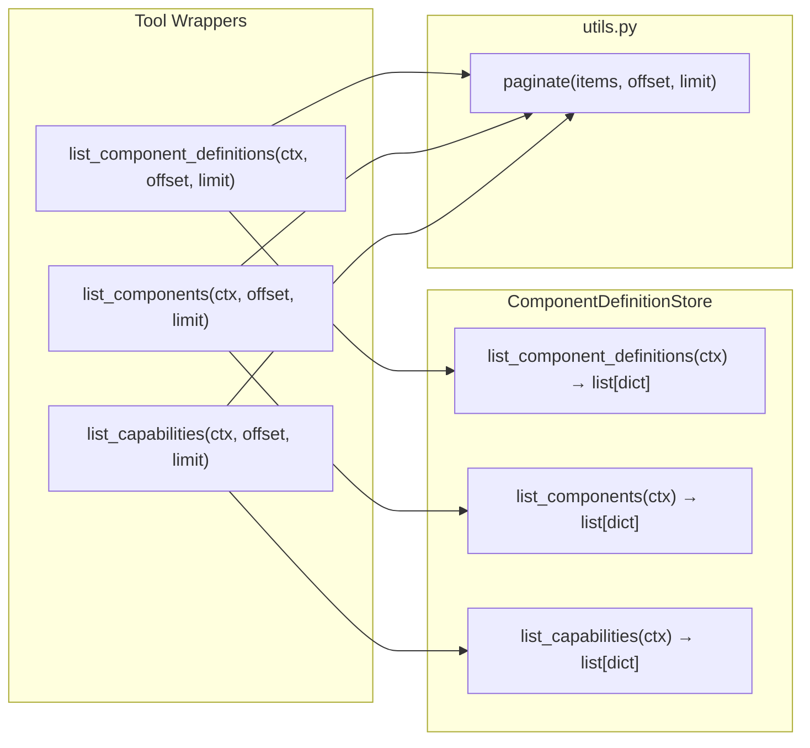

# Design Document: list-tools-pagination

## Overview

This feature adds offset/limit pagination to the three list tools (`list_component_definitions`, `list_components`, `list_capabilities`) in the OSCAL MCP server. Today these tools return the entire result set at once, which can overflow an AI assistant's context window when many OSCAL artifacts are loaded.

The design introduces a standalone `paginate()` helper function in `src/mcp_server_for_oscal/tools/utils.py` that slices any list into a page and returns a standardized response envelope. The `@tool()` wrappers are updated to accept `offset` and `limit` parameters, call the existing `ComponentDefinitionStore` list methods (unchanged), and pass the result through `paginate()`.

### Design Decisions

1. **Standalone function, not a method** — `paginate()` lives in `utils.py` so any future tool can reuse it without coupling to `ComponentDefinitionStore`.
2. **No external pagination library** — Neither the `mcp` SDK (cursor-based protocol-layer pagination) nor `strands-agents` (`PaginatedList` is a return-type wrapper) provide an offset/limit slicing helper. A simple function is sufficient.
3. **Pagination at the tool wrapper layer, not the store** — The `ComponentDefinitionStore` list methods remain unchanged (returning full `list[dict]`). Pagination is a presentation concern applied at the `@tool()` boundary. This keeps the store focused on data retrieval and avoids threading `offset`/`limit` through two layers for no benefit.
4. **Defaults preserve usability** — `offset=0` and `limit=10` mean callers that omit pagination params get a small first page instead of the full set. `max_limit=100` prevents accidental context-window blowouts.
5. **Return type changes from `list[dict]` to `dict`** — The new envelope (`items`, `total`, `offset`, `limit`, `hasMore`) is a breaking change to the tool response shape, but is necessary for callers to know whether more pages exist.

## Architecture



The flow is:
1. Caller invokes a `@tool()` wrapper with optional `offset` and `limit`.
2. The wrapper calls the corresponding `ComponentDefinitionStore` method, which returns the full `list[dict]` (unchanged).
3. The wrapper passes the full list to `paginate(items, offset, limit)`.
4. `paginate()` validates inputs, slices the list, and returns a `Page_Response` dict.

## Components and Interfaces

### `paginate()` — `src/mcp_server_for_oscal/tools/utils.py`

```python
def paginate(
    items: list[dict],
    offset: int = 0,
    limit: int = 10,
) -> dict:
    """Slice a list into a single page and return a Page_Response envelope.

    Args:
        items: The full, ordered list of result dicts.
        offset: Zero-based index of the first item to return.
        limit: Maximum number of items to return (1–100).

    Returns:
        dict with keys: items, total, offset, limit, hasMore.

    Raises:
        ValueError: If offset < 0 or limit < 1 or limit > 100.
    """
```

### `ComponentDefinitionStore` methods — unchanged

The three list methods retain their current signatures and return types (`list[dict]`). No changes needed:

```python
def list_component_definitions(self, ctx: Context) -> list[dict]: ...
def list_components(self, ctx: Context) -> list[dict]: ...
def list_capabilities(self, ctx: Context) -> list[dict]: ...
```

### Updated `@tool()` wrappers

Each wrapper gains `offset` and `limit` parameters, calls the store method for the full list, then applies `paginate()`:

```python
@tool()
def list_component_definitions(
    ctx: Context, offset: int = 0, limit: int = 10
) -> dict:
    items = _store.list_component_definitions(ctx)
    return paginate(items, offset, limit)

@tool()
def list_components(
    ctx: Context, offset: int = 0, limit: int = 10
) -> dict:
    items = _store.list_components(ctx)
    return paginate(items, offset, limit)

@tool()
def list_capabilities(
    ctx: Context, offset: int = 0, limit: int = 10
) -> dict:
    items = _store.list_capabilities(ctx)
    return paginate(items, offset, limit)
```

## Data Models

### Page_Response (returned dict)

| Key | Type | Description |
|---|---|---|
| `items` | `list[dict]` | The sliced page of summary dicts. Same shape as current tool output items. |
| `total` | `int` | Total number of items across all pages. |
| `offset` | `int` | The offset that was used (including default). |
| `limit` | `int` | The limit that was used (including default). |
| `hasMore` | `bool` | `True` iff `offset + limit < total`. |

### Input constraints

| Parameter | Type | Default | Constraints |
|---|---|---|---|
| `offset` | `int` | `0` | Must be ≥ 0. |
| `limit` | `int` | `10` | Must be ≥ 1 and ≤ 100. |

### Item shapes (unchanged)

The dicts inside `items` retain their current shapes:

- **Component Definition summary**: `uuid`, `title`, `componentCount`, `importedComponentDefinitionsCount`, `sizeInBytes`
- **Component summary**: `uuid`, `title`, `parentComponentDefinitionTitle`, `parentComponentDefinitionUuid`, `sizeInBytes`
- **Capability summary**: `uuid`, `name`, `parentComponentDefinitionTitle`, `parentComponentDefinitionUuid`, `sizeInBytes`


## Correctness Properties

*A property is a characteristic or behavior that should hold true across all valid executions of a system — essentially, a formal statement about what the system should do. Properties serve as the bridge between human-readable specifications and machine-verifiable correctness guarantees.*

The prework analysis identified that requirements 1.x, 2.x, and 3.x are largely redundant with each other because all three tools delegate to the same `paginate()` function. The consolidated properties below test `paginate()` directly, which covers all three tools. Integration-level examples verify that each tool correctly wires through to `paginate()`.

### Property 1: Pagination round-trip

*For any* list of dicts and *for any* valid limit (1–100), iterating through all pages by advancing offset by limit each time and concatenating the `items` from each page SHALL produce a list identical to the original input list in both content and order.

**Validates: Requirements 4.4, 1.1, 2.1, 3.1, 5.2**

### Property 2: Page size invariant

*For any* list of dicts and *for any* valid offset (≥ 0) and limit (1–100), the number of items returned in `items` SHALL be less than or equal to `limit`.

**Validates: Requirements 4.5, 1.1, 2.1, 3.1**

### Property 3: hasMore correctness

*For any* list of dicts and *for any* valid offset (≥ 0) and limit (1–100), `hasMore` SHALL be `True` if and only if `offset + limit < total`.

**Validates: Requirements 4.6, 1.3, 2.3, 3.3**

### Property 4: Response shape and metadata

*For any* list of dicts and *for any* valid offset (≥ 0) and limit (1–100), the returned dict SHALL contain exactly the keys `items`, `total`, `offset`, `limit`, `hasMore`; `total` SHALL equal the length of the original input list; and `offset` and `limit` SHALL equal the values passed to `paginate()`.

**Validates: Requirements 5.1, 5.3, 5.5, 1.3, 2.3, 3.3**

### Property 5: Invalid inputs raise ValueError

*For any* negative integer as offset, or *for any* limit outside the range [1, 100], calling `paginate()` SHALL raise a `ValueError`.

**Validates: Requirements 4.3, 1.5, 1.6, 2.5, 2.6, 3.5, 3.6**

### Property 6: Beyond-end offset yields empty page

*For any* list of dicts and *for any* offset ≥ len(list) and *for any* valid limit (1–100), `items` SHALL be an empty list and `hasMore` SHALL be `False`.

**Validates: Requirements 1.4, 2.4, 3.4**

## Error Handling

| Condition | Raised by | Exception | Message pattern |
|---|---|---|---|
| `offset < 0` | `paginate()` | `ValueError` | `"offset must be non-negative, got {offset}"` |
| `limit < 1` | `paginate()` | `ValueError` | `"limit must be between 1 and 100, got {limit}"` |
| `limit > 100` | `paginate()` | `ValueError` | `"limit must be between 1 and 100, got {limit}"` |
| No component definitions loaded | `list_component_definitions()` | `RuntimeError` | `"No Component Definitions loaded"` (unchanged) |
| No components loaded | `list_components()` | `RuntimeError` | `"No Components loaded"` (unchanged) |
| No capabilities loaded | `list_capabilities()` | Returns empty page | `Page_Response` with `items=[], total=0, hasMore=False` (unchanged behavior — capabilities are optional) |

Validation errors from `paginate()` propagate up through the tool wrappers unmodified. The existing `RuntimeError` behavior for empty stores is preserved — the store methods raise before `paginate()` is ever called.

## Testing Strategy

### Property-based tests (hypothesis)

All six correctness properties are tested via `hypothesis` with a minimum of 100 examples each. Tests target the `paginate()` function directly since all three tools delegate to it.

Each test is tagged with a comment referencing its design property:
```
# Feature: list-tools-pagination, Property {N}: {title}
```

Generators:
- `items`: `st.lists(st.fixed_dictionaries({"id": st.integers()}))` — arbitrary-length lists of dicts
- `offset`: `st.integers(min_value=0, max_value=200)` for valid; `st.integers(max_value=-1)` for invalid
- `limit`: `st.integers(min_value=1, max_value=100)` for valid; `st.one_of(st.integers(max_value=0), st.integers(min_value=101))` for invalid

Library: `hypothesis` (already in devtest dependencies)

Configuration: `@settings(max_examples=100)` on each property test.

### Unit tests (pytest)

Unit tests cover concrete examples and integration points:

1. **Default parameters** — each of the three tool wrappers called without `offset`/`limit` returns `offset=0, limit=10` in the response (validates requirements 1.2, 2.2, 3.2).
2. **Empty capabilities** — `list_capabilities` with no data returns `Page_Response` with `items=[], total=0, hasMore=False` (validates requirement 3.7).
3. **Integration smoke test** — each tool wrapper with a loaded fixture returns a valid `Page_Response` with correct `items` content, confirming the wiring from `@tool()` → `paginate()`.
4. **Existing `TestListMethods` updates** — the existing tests in `tests/tools/test_query_component_definition.py` are updated to expect the new `dict` return type with `items` key instead of `list[dict]`. Store method tests remain unchanged since the store still returns `list[dict]`.

### Test file locations

- Property tests for `paginate()`: `tests/tools/test_paginate.py` (new file)
- Unit tests for tool integration: updated in `tests/tools/test_query_component_definition.py` within `TestListMethods`
