# Design Document: Local Documentation Search

## Overview

This feature replaces the `query_local()` stub in `query_documentation.py` with a working FTS5 full-text search over bundled `oscal_docs/` markdown files, and makes the `query_oscal_documentation` tool unconditionally available. It also upgrades the file change-detection mechanism from mtime+size to SHA-256 content hashing across all indexed files.

The design touches six areas:

1. **Markdown indexing** — Extend `OscalStore.scan_directory()` to recognize `.md` files and insert them into the `documents` + `fts_index` tables with `entity_type="documentation"`.
2. **Documentation-scoped search** — Add a `search_documentation()` method on `OscalStore` that queries `fts_index` filtered to `entity_type="documentation"`, with FTS5→LIKE fallback.
3. **query_local replacement** — Wire `query_documentation.py` to use the new `search_documentation()` via an `init_store()` singleton pattern.
4. **Unconditional registration** — Remove the `config.knowledge_base_id` guard in `tools/__init__.py` so the tool is always available, with KB fallback to local search on failure.
5. **SHA-256 change detection** — Replace `_file_unchanged()` mtime+size check with content-hash comparison; add `content_hash` column to `documents` table with migration support.
6. **Build & startup wiring** — Ensure `build_oscal_db.py` indexes markdown from `oscal_docs/`, and `main.py` scans `oscal_docs/` at runtime and calls `query_documentation.init_store(store)`.

## Architecture

```mermaid
flowchart TD
    subgraph Startup ["Server Startup (main.py)"]
        A[_init_oscal_store] --> B[OscalStore.__init__]
        B --> C[store.scan_directory component_definitions/]
        C --> D[store.scan_directory oscal_docs/]
        D --> E[query_oscal_models.init_store]
        E --> F[query_documentation.init_store]
        F --> G[_setup_tools]
    end

    subgraph Tool ["query_oscal_documentation"]
        H{config.knowledge_base_id?}
        H -- yes --> I[query_kb via Bedrock]
        I -- exception --> J[query_local fallback]
        H -- no --> J
        J --> K[OscalStore.search_documentation]
    end

    subgraph Store ["OscalStore"]
        L[scan_directory]
        L --> M{file extension}
        M -- .json --> N[_process_json_file]
        M -- .md --> O[_process_markdown_file]
        M -- .zip --> P[_process_zip_file]
        O --> Q[_upsert_document with entity_type=documentation]
        Q --> R[Insert into fts_index]
        S[search_documentation] --> T{FTS5 MATCH}
        T -- success --> U[Return ranked results]
        T -- OperationalError --> V[LIKE fallback]
    end
```



## Components and Interfaces

### 1. OscalStore — Markdown Indexing

New method `_process_markdown_file(md_file: Path) -> bool`:
- Reads the file content as UTF-8 text.
- Skips empty files (logs warning).
- Derives title from first markdown heading (`# ...`, `## ...`, etc.) or falls back to filename with `.md` stripped and hyphens/underscores replaced by spaces.
- Generates a deterministic UUID from the file path using `uuid5(NAMESPACE_URL, file_path_str)`.
- Computes SHA-256 content hash (binary read, `hashlib.sha256`).
- Calls `_file_unchanged()` (now hash-based) to skip unchanged files.
- Calls `_upsert_document()` with `model_type="documentation"` and `raw_json` set to the markdown text content.
- Inserts a row into `fts_index` with `entity_type="documentation"`, `entity_id` = document row id, `title` = derived title, `description` = full markdown body, `model_type="documentation"`.

Modified `scan_directory()`:
- After processing `.json` and `.zip` files, also glob for `*.md` files and call `_process_markdown_file()` for each.

### 2. OscalStore — Documentation-Scoped Search

New method `search_documentation(query_text: str, offset: int = 0, limit: int = 10) -> dict`:
- Returns empty page response for empty/whitespace-only queries.
- Executes FTS5 MATCH on `fts_index` filtered to `entity_type = 'documentation'`.
- On `sqlite3.OperationalError`, falls back to LIKE search on title and description columns, also filtered to `entity_type = 'documentation'`.
- Each result item contains: `title`, `snippet` (up to 200 chars around match), `source` (file_path from documents table).
- Returns standard page response dict: `items`, `total`, `offset`, `limit`, `hasMore`.

To produce snippets, the FTS5 `snippet()` function will be used: `snippet(fts_index, 3, '<b>', '</b>', '...', 40)` where column 3 is `description`. For the LIKE fallback, a Python-side substring extraction around the first match position will produce the snippet.

### 3. OscalStore — SHA-256 Change Detection

Modified `_file_unchanged(file_path: str, content_hash: str) -> bool`:
- Signature changes: replaces `file_size` and `file_mtime` params with `content_hash`.
- Queries `content_hash` from `documents` WHERE `file_path = ?`.
- Returns `True` if stored hash matches the provided hash.

Modified `_init_schema()`:
- Adds `content_hash TEXT` column to the `documents` CREATE TABLE statement.
- Adds migration: `ALTER TABLE documents ADD COLUMN content_hash TEXT` wrapped in a try/except to handle existing DBs that already have the column.

Modified `_upsert_document()`:
- Accepts new `content_hash` parameter.
- Stores it in the INSERT and ON CONFLICT UPDATE clauses.

Modified `_process_json_file()`:
- Computes SHA-256 of file content (binary read) before checking `_file_unchanged()`.
- Passes `content_hash` to `_file_unchanged()` and `_upsert_document()`.

Modified `_process_zip_file()`:
- Computes SHA-256 of each inner file's raw bytes.
- Passes `content_hash` to `_file_unchanged()` and `_upsert_document()`.

### 4. query_documentation Module

New `init_store(store: OscalStore) -> None`:
- Sets module-level `_store` variable (same pattern as `query_oscal_models.py`).

New `_get_store() -> OscalStore`:
- Returns `_store` or raises `RuntimeError` if not initialized.

Modified `query_local(query: str, ctx: Context | None) -> dict`:
- If `_store is None`, returns `{"error": "OscalStore has not been initialized"}`.
- Otherwise delegates to `_store.search_documentation(query)`.
- Returns the result dict unchanged.

Modified `query_oscal_documentation(query: str, ctx: Context | None)`:
- Logs which search path is being used.
- If `config.knowledge_base_id` is set, tries `query_kb()`. On exception, falls back to `query_local()`.
- If `config.knowledge_base_id` is not set, calls `query_local()` directly.

### 5. Tool Registration

Modified `tools/__init__.py` `get_tool_list()`:
- Moves the `query_oscal_documentation` import and append outside the `if config.knowledge_base_id:` guard, making it unconditional.

### 6. Startup Wiring (main.py)

Modified `_init_oscal_store()`:
- After existing `scan_directory()` calls, adds `store.scan_directory(my_dir / "oscal_docs")` to index markdown documentation at runtime.
- Adds `query_documentation.init_store(store)` alongside existing `init_store()` calls.

### 7. Build Script (bin/build_oscal_db.py)

The build script already scans `oscal_docs/` via `store.scan_directory(oscal_docs_dir)`. Once `scan_directory()` is extended to handle `.md` files, the build script will automatically index markdown documentation into the bundled DB. No changes needed to `build_oscal_db.py`.

## Data Models

### documents Table (Modified)

```sql
CREATE TABLE IF NOT EXISTS documents (
    id           INTEGER PRIMARY KEY AUTOINCREMENT,
    uuid         TEXT    NOT NULL UNIQUE,
    title        TEXT    NOT NULL,
    model_type   TEXT    NOT NULL,        -- existing OSCAL types + "documentation"
    file_path    TEXT    NOT NULL UNIQUE,
    file_size    INTEGER NOT NULL,
    file_mtime   REAL    NOT NULL,
    content_hash TEXT,                     -- NEW: SHA-256 hex digest
    raw_json     TEXT    NOT NULL,         -- for docs: markdown text content
    indexed      INTEGER NOT NULL DEFAULT 0,
    created_at   TEXT    NOT NULL DEFAULT (datetime('now')),
    updated_at   TEXT    NOT NULL DEFAULT (datetime('now'))
)
```

Migration for existing DBs:
```sql
ALTER TABLE documents ADD COLUMN content_hash TEXT;
```

When `content_hash` is NULL (pre-migration rows), `_file_unchanged()` returns `False`, forcing re-indexing on next scan.

### fts_index Virtual Table (Unchanged Schema)

```sql
CREATE VIRTUAL TABLE IF NOT EXISTS fts_index USING fts5(
    entity_type,   -- "document", "child_element", "documentation"
    entity_id,
    title,
    description,   -- for documentation: full markdown body
    model_type     -- for documentation: "documentation"
)
```

No schema change needed — the existing FTS5 table accommodates documentation entries via the `entity_type` discriminator.

### Documentation Search Result Item

```python
{
    "title": str,       # Derived from first heading or filename
    "snippet": str,     # Up to 200 chars around matched text
    "source": str,      # file_path from documents table
}
```

### Page Response (Standard)

```python
{
    "items": list[dict],
    "total": int,
    "offset": int,
    "limit": int,
    "hasMore": bool,
}
```

## Correctness Properties

*A property is a characteristic or behavior that should hold true across all valid executions of a system — essentially, a formal statement about what the system should do. Properties serve as the bridge between human-readable specifications and machine-verifiable correctness guarantees.*

### Property 1: Markdown Indexing Round-Trip

*For any* valid markdown file with non-empty content, after `scan_directory()` processes it, the `documents` table SHALL contain a row with `model_type="documentation"`, `raw_json` equal to the file's text content, and a correct SHA-256 `content_hash`; AND the `fts_index` table SHALL contain a corresponding row with `entity_type="documentation"` and `description` equal to the full markdown body text.

**Validates: Requirements 1.1, 1.4, 6.1**

### Property 2: Title Derivation from Markdown Content

*For any* markdown file content, the derived title SHALL equal the text of the first markdown heading (any `#` level) if one exists; otherwise, the title SHALL equal the filename with the `.md` extension removed and hyphens/underscores replaced by spaces.

**Validates: Requirements 1.2**

### Property 3: SHA-256 Change Detection

*For any* file content, scanning the same unchanged file twice SHALL result in the second scan returning 0 new documents (idempotence). *For any* two distinct file contents written to the same path, scanning after replacing the first content with the second SHALL result in re-indexing (the stored `content_hash` updates to match the new content), even if the two contents have the same byte length.

**Validates: Requirements 1.3, 6.4**

### Property 4: Documentation Search Scoping

*For any* OscalStore containing both OSCAL model documents and documentation entries, calling `search_documentation()` with any query string SHALL return only results where `entity_type` is `"documentation"` — no OSCAL model content (catalogs, SSPs, etc.) SHALL appear in the results.

**Validates: Requirements 2.1**

### Property 5: Search Result Structure

*For any* non-empty search query that produces results from `search_documentation()`, each result item SHALL contain a `"title"` string, a `"snippet"` string of at most 200 characters, and a `"source"` string representing the file path. The response dict SHALL contain keys `"items"`, `"total"`, `"offset"`, `"limit"`, and `"hasMore"`.

**Validates: Requirements 2.3, 2.6**

### Property 6: Empty Query Returns Empty Response

*For any* string composed entirely of whitespace characters (including the empty string), `search_documentation()` SHALL return a page response with `items` as an empty list, `total` of 0, and `hasMore` of `False`.

**Validates: Requirements 2.4, 3.5**

## Error Handling

| Scenario | Behavior |
|---|---|
| Empty/unreadable markdown file during scan | Skip file, log warning (Req 1.6) |
| Invalid FTS5 query syntax in search_documentation | Catch `sqlite3.OperationalError`, fall back to LIKE search (Req 2.5) |
| `query_local()` called before `init_store()` | Return `{"error": "OscalStore has not been initialized"}` (Req 3.3) |
| Bedrock KB query fails (network, credentials) | Catch exception, fall back to `query_local()` (Req 4.4) |
| Both KB and local search unavailable | Return error dict indicating no search backend available (Req 4.6) |
| Existing DB missing `content_hash` column | `ALTER TABLE ADD COLUMN` migration; NULL hash forces re-scan (Req 6.6) |
| `_init_oscal_store()` fails before `query_documentation.init_store()` | `_store` remains `None`; `query_local()` returns error dict (Req 5.4) |
| `query_kb()` raises exception | Log, notify `ctx.error()`, re-raise original exception (Req 7.3) |

## Testing Strategy

### Property-Based Tests (Hypothesis)

The project already uses Hypothesis for property-based testing. Each property above maps to a Hypothesis test with minimum 100 iterations.

- **Property 1 (Markdown Indexing Round-Trip)**: Generate random markdown strings (with `st.text()`), write to temp files, scan, verify DB state.
  - Tag: `Feature: local-documentation-search, Property 1: Markdown indexing round-trip`
- **Property 2 (Title Derivation)**: Generate markdown content with `st.one_of(heading_strategy, no_heading_strategy)` and random filenames, verify title extraction logic.
  - Tag: `Feature: local-documentation-search, Property 2: Title derivation from markdown content`
- **Property 3 (SHA-256 Change Detection)**: Generate two distinct content strings, write first, scan, write second, scan again, verify re-indexing occurred and hash updated.
  - Tag: `Feature: local-documentation-search, Property 3: SHA-256 change detection`
- **Property 4 (Documentation Search Scoping)**: Generate a mix of markdown and JSON OSCAL files, index both, search via `search_documentation()`, verify all results are documentation-typed.
  - Tag: `Feature: local-documentation-search, Property 4: Documentation search scoping`
- **Property 5 (Search Result Structure)**: Generate markdown content containing searchable terms, index, search, verify result item keys and snippet length constraint.
  - Tag: `Feature: local-documentation-search, Property 5: Search result structure`
- **Property 6 (Empty Query)**: Generate whitespace-only strings via `st.from_regex(r'^\s*$')`, call `search_documentation()`, verify empty response.
  - Tag: `Feature: local-documentation-search, Property 6: Empty query returns empty response`

### Unit Tests (pytest)

- FTS5 fallback to LIKE on invalid syntax (Req 2.5)
- `query_local()` returns error when store not initialized (Req 3.3)
- `init_store()` sets module-level singleton (Req 3.2, 5.1)
- Unconditional tool registration (Req 4.1)
- KB path used when `knowledge_base_id` set (Req 4.2, 7.1)
- Local path used when `knowledge_base_id` not set (Req 4.3)
- KB failure falls back to local search (Req 4.4)
- Logging of search path selection (Req 4.5)
- Error response when no backend available (Req 4.6)
- `query_kb()` error handling preserves existing behavior (Req 7.2, 7.3)
- Empty/unreadable markdown files skipped with warning (Req 1.6)
- Schema migration adds `content_hash` column (Req 6.5, 6.6)

### Integration Tests

- Build script indexes markdown from `oscal_docs/` (Req 1.5)
- `_init_oscal_store()` calls `query_documentation.init_store()` and scans `oscal_docs/` (Req 5.2, 5.3)
- End-to-end: scan real `oscal_docs/` directory, search for known content, verify results
