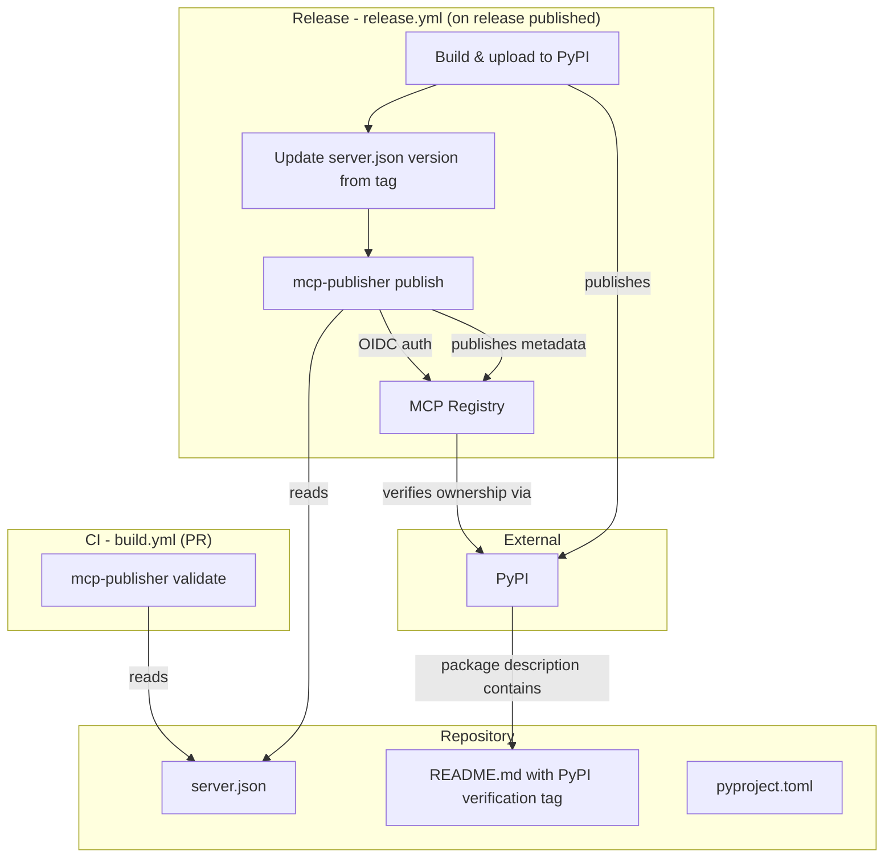

# Design Document: MCP Registry Publishing

## Overview

This feature adds MCP Registry publishing support to `mcp-server-for-oscal`. It involves:

1. A static `server.json` metadata file in the project root conforming to the MCP Registry schema
2. A PyPI ownership verification HTML comment in `README.md`
3. Version synchronization between git tags and `server.json` during releases
4. A GitHub Actions job that publishes to the MCP Registry after PyPI publish using OIDC auth
5. A CI validation step that checks `server.json` schema compliance on PRs
6. Documentation of environment variables in `server.json`

The feature is primarily configuration and CI/CD focused — no runtime Python code changes are needed. The core artifacts are `server.json`, modifications to `README.md`, and GitHub Actions workflow updates.

## Architecture



The architecture is a pipeline: `server.json` is the single source of truth for registry metadata. CI validates it on every PR. On release, the workflow updates the version, publishes to PyPI first, then publishes to the MCP Registry using GitHub OIDC for authentication. The registry verifies PyPI ownership by checking the HTML comment in the published README.

### Design Decisions

1. **Static `server.json` over generated**: The file is hand-authored and checked into the repo rather than generated at build time. This keeps it auditable and diff-friendly. Only the `version` field is updated dynamically during release.

2. **Version update in release workflow**: Rather than requiring developers to manually update the version in `server.json` before each release, the workflow extracts the version from the git tag (which `hatch-vcs` already uses) and patches `server.json` before publishing. This avoids version drift.

3. **Separate MCP publish job**: The MCP Registry publish runs as a separate job (or step after PyPI publish) so that a failure in registry publishing does not affect the PyPI release. This is a non-blocking, additive step.

4. **`mcp-publisher` CLI for validation and publishing**: Using the official CLI tool ensures compatibility with the registry's expectations. No custom schema validation code is needed.

5. **OIDC over stored secrets**: GitHub OIDC tokens are short-lived and don't require managing long-lived secrets, matching the existing PyPI trusted publishing pattern already in `release.yml`.

## Components and Interfaces

### 1. `server.json` (New File)

A JSON file in the project root conforming to `https://static.modelcontextprotocol.io/schemas/2025-12-11/server.schema.json`. Contains:
- Server identity (`name`, `title`, `description`, `version`)
- Repository metadata (`url`, `source`)
- Package distribution info (`packages` array with PyPI entry)
- Environment variable documentation (`environmentVariables`)

### 2. `README.md` (Modified)

Add an HTML comment near the top of the file:
```html
<!-- mcp-name: io.github.awslabs/mcp-server-for-oscal -->
```
This comment is invisible to rendered markdown but present in the PyPI package description, allowing the MCP Registry to verify ownership.

### 3. `.github/workflows/build.yml` (Modified)

Add a step to validate `server.json` using `mcp-publisher validate` (or `jsonschema` validation). This runs on every push and PR to `main`.

### 4. `.github/workflows/release.yml` (Modified)

Add a new job `mcp-registry-publish` that:
- Depends on the existing `pypi-publish` job
- Checks out the repo
- Installs `mcp-publisher` via `npx`
- Extracts the version from the release tag
- Updates `server.json` version fields using `jq` or a simple script
- Validates the updated `server.json`
- Publishes to the MCP Registry using `mcp-publisher publish` with OIDC auth
- Has `id-token: write` permission for OIDC
- Continues on error to not block the release

### 5. Version Sync Script (Inline in Workflow)

A shell snippet in the release workflow that:
- Extracts the semver from the git tag (stripping any `v` prefix)
- Uses `jq` to update `.version` and `.packages[].version` in `server.json`
- Validates the version matches before proceeding

## Data Models

### server.json Schema

```json
{
  "$schema": "https://static.modelcontextprotocol.io/schemas/2025-12-11/server.schema.json",
  "name": "io.github.awslabs/mcp-server-for-oscal",
  "title": "MCP Server for OSCAL",
  "description": "AI agent tools for Open Security Controls Assessment Language (OSCAL)",
  "version": "0.0.0",
  "repository": {
    "url": "https://github.com/awslabs/mcp-server-for-oscal",
    "source": "github"
  },
  "packages": [
    {
      "registryType": "pypi",
      "name": "mcp-server-for-oscal",
      "version": "0.0.0",
      "transport": [
        {
          "type": "stdio"
        }
      ],
      "environmentVariables": [
        {
          "name": "BEDROCK_MODEL_ID",
          "description": "AWS Bedrock model ID for OSCAL documentation queries",
          "required": false
        },
        {
          "name": "OSCAL_KB_ID",
          "description": "AWS Bedrock Knowledge Base ID for OSCAL documentation",
          "required": false
        },
        {
          "name": "AWS_PROFILE",
          "description": "AWS CLI profile name for credential resolution",
          "required": false
        },
        {
          "name": "AWS_REGION",
          "description": "AWS region for Bedrock API calls",
          "required": false
        },
        {
          "name": "LOG_LEVEL",
          "description": "Logging verbosity level (DEBUG, INFO, WARNING, ERROR)",
          "required": false
        }
      ]
    }
  ]
}
```

The `version` fields are set to `"0.0.0"` as a placeholder — the release workflow updates them from the git tag. The `environmentVariables` array is nested inside the package entry per the MCP Registry schema.


## Correctness Properties

*A property is a characteristic or behavior that should hold true across all valid executions of a system — essentially, a formal statement about what the system should do. Properties serve as the bridge between human-readable specifications and machine-verifiable correctness guarantees.*

### Property 1: Version Update Consistency

*For any* valid semantic version string, after applying the version update logic to `server.json`, the top-level `version` field and every `version` field inside each `packages` entry must all equal the input version string.

**Validates: Requirements 3.1, 3.2**

### Property 2: Environment Variable Entry Completeness

*For any* entry in the `environmentVariables` array of `server.json`, the entry must have a non-empty `name` string, a non-empty `description` string, and a `required` field that is a boolean value.

**Validates: Requirements 6.1, 6.3**

### Property 3: Cross-File Name Consistency

*For any* valid `server.json` and `README.md` pair, the server name extracted from the `<!-- mcp-name: ... -->` HTML comment in `README.md` must exactly equal the `name` field in `server.json`.

**Validates: Requirements 2.2**

## Error Handling

| Scenario | Behavior |
|---|---|
| `server.json` fails schema validation in CI | Build workflow fails, validation errors reported in CI output |
| `mcp-publisher publish` fails during release | Release workflow reports failure but PyPI publish is unaffected (separate job or `continue-on-error`) |
| Version mismatch between tag and `server.json` | Release workflow fails the MCP Registry publish step and logs the mismatch |
| `mcp-publisher` CLI not available | CI step fails with clear error; `npx` handles installation automatically |
| Invalid JSON in `server.json` | Schema validation catches parse errors in both CI and release workflows |
| Missing PyPI verification tag in README | MCP Registry rejects the publish; error surfaced in release workflow logs |

## Testing Strategy

### Unit Tests (Example-Based)

Unit tests verify specific, concrete expectations about the static artifacts:

- `server.json` contains required fields with correct values (Req 1.1–1.5)
- `server.json` is valid JSON (Req 1.6)
- `README.md` contains the PyPI verification HTML comment (Req 2.1)
- Specific environment variables are documented (Req 6.2)
- Release workflow YAML has `id-token: write` permission (Req 4.2)
- Release workflow uses `mcp-publisher` CLI (Req 4.3)
- Release workflow has error isolation for MCP publish step (Req 4.4)
- Release workflow has correct job dependency ordering (Req 4.5)
- Build workflow includes `server.json` validation step (Req 5.1, 5.3)

### Property-Based Tests

Property-based tests use Hypothesis to verify universal properties across generated inputs:

- **Property 1**: Version update consistency — generate random semver strings, apply the version update function, verify all version fields match (min 100 iterations)
- **Property 2**: Environment variable entry completeness — generate random env var entries, verify each has required fields with correct types (min 100 iterations)
- **Property 3**: Cross-file name consistency — verify the README tag and server.json name are always in sync (example-based since there's only one pair, but the extraction logic can be property-tested with generated names)

### Property-Based Testing Configuration

- Library: `hypothesis` (already a project dependency)
- Minimum iterations: 100 per property test (`@settings(max_examples=100)`)
- Each test tagged with: `Feature: mcp-registry-publishing, Property {N}: {title}`
- Each correctness property implemented by a single property-based test
- Tests located in `tests/test_mcp_registry_properties.py`

### Test File Organization

- `tests/test_server_json.py` — unit tests for `server.json` content and structure
- `tests/test_mcp_registry_properties.py` — property-based tests for correctness properties
- `tests/test_readme_verification.py` — unit tests for README verification tag
- `tests/test_workflow_validation.py` — unit tests for GitHub Actions workflow configuration
