# Design Document: OSCAL Agent Production

## Overview

This design covers the refactoring of the `oscal_agent.py` module from an unused prototype into a production-ready Strands agent, along with centralizing the tool registry so both the MCP server and the agent share a single source of truth. The work spans ten requirements: centralized tool registry, removal of global state, error handling, retry strategy, max tokens configuration, observability hooks, system prompt refinement, test coverage, dead code cleanup in `main.py`, and a standalone agent entry point.

The changes are scoped to four primary files (`tools/__init__.py`, `oscal_agent.py`, `config.py`, `main.py`) plus two new test files (`test_oscal_agent.py`, `test_tool_registry.py`), with a minor addition to `pyproject.toml` for the agent entry point.

## Architecture

The current architecture has the MCP server (`main.py`) manually importing and registering each tool, while `oscal_agent.py` uses `load_tools_from_directory=True` (which doesn't work) and stores the agent in a mutable global. The refactored architecture introduces a centralized tool registry as the single source of truth.

```mermaid
graph TD
    subgraph "Tool Registry (tools/__init__.py)"
        TR[get_tool_list] --> T1[list_oscal_models]
        TR --> T2[get_oscal_schema]
        TR --> T3[list_oscal_resources]
        TR --> T4[query_component_definition]
        TR --> T5[list_component_definitions]
        TR --> T6[list_components]
        TR --> T7[list_capabilities]
        TR --> T8[get_capability]
        TR --> T9[validate_oscal_content]
        TR --> T10[validate_oscal_file]
        TR -.->|conditional| T11[query_oscal_documentation]
    end

    subgraph "MCP Server (main.py)"
        MS[_setup_tools] -->|consumes| TR
        MS --> ABOUT[about tool - MCP only]
        MS --> MCP[FastMCP.run]
    end

    subgraph "Agent (oscal_agent.py)"
        CA[create_oscal_agent] -->|consumes| TR
        CA --> BM[BedrockModel]
        CA --> RS[ModelRetryStrategy]
        CA --> HK[AgentObservabilityHook]
        CA --> AG[Agent instance]
        MAIN_A[main] --> CA
        MAIN_A --> LOOP[Interactive stdin/stdout loop]
    end

    subgraph "Config (config.py)"
        CFG[Config] --> agent_max_tokens
        CFG --> agent_max_retry_attempts
        CFG --> agent_retry_initial_delay
        CFG --> agent_retry_max_delay
    end

    CA -->|reads| CFG
    MS -->|reads| CFG
```



### Key Design Decisions

1. **Tool registry as a function, not a module-level list.** The registry must evaluate `config.knowledge_base_id` at call time (not import time) to support the conditional `query_oscal_documentation` inclusion. A function `get_tool_list()` in `tools/__init__.py` achieves this.

2. **No shared CLI module.** Requirement 10.9 explicitly forbids a shared CLI module. Both `main.py` and `oscal_agent.py` define their own `argparse` setup. Shared behavior (config, integrity verification) is consumed from existing modules.

3. **HookProvider for observability.** Strands SDK supports the `HookProvider` protocol with typed events. We implement `AgentObservabilityHook` as a class in `oscal_agent.py` that handles `BeforeToolCallEvent`, `AfterModelCallEvent`, and `AfterInvocationEvent`.

4. **Agent is stateless at module level.** The caller (either the `main()` entry point or test code) owns the agent lifecycle. `create_oscal_agent()` is a pure factory function.

## Components and Interfaces

### 1. Tool Registry (`src/mcp_server_for_oscal/tools/__init__.py`)

```python
def get_tool_list() -> list[Callable]:
    """Return the canonical list of OSCAL tool functions.
    
    Conditionally includes query_oscal_documentation when
    config.knowledge_base_id is set.
    """
```

This function imports all tool functions and returns them as a list. The `about` tool is excluded — it remains MCP-server-only.

### 2. Agent Factory (`src/mcp_server_for_oscal/oscal_agent.py`)

```python
def create_oscal_agent(
    tools: list[Callable] | None = None,
) -> Agent:
    """Create a production-ready OSCAL Strands agent.
    
    Args:
        tools: Optional list of tool functions. Defaults to get_tool_list().
    
    Returns:
        Configured Agent instance.
    
    Raises:
        ValueError: If boto3 session or BedrockModel creation fails.
    """
```

```python
class AgentObservabilityHook:
    """HookProvider that logs agent lifecycle events.
    
    Handles:
        - BeforeToolCallEvent: logs tool name + truncated args at DEBUG
        - AfterModelCallEvent: logs stop reason + token usage at DEBUG
        - AfterInvocationEvent: logs completion at DEBUG
    Also logs retry/throttle events at WARNING.
    """
```

```python
def main() -> None:
    """Standalone agent entry point.
    
    Parses CLI args, configures logging, verifies integrity,
    creates agent, runs interactive loop.
    """
```

### 3. Config Extensions (`src/mcp_server_for_oscal/config.py`)

New attributes on the `Config` class:

| Attribute | Env Var | Default | Type |
|---|---|---|---|
| `agent_max_tokens` | `OSCAL_AGENT_MAX_TOKENS` | `4096` | `int` |
| `agent_max_retry_attempts` | `OSCAL_AGENT_MAX_RETRY_ATTEMPTS` | `4` | `int` |
| `agent_retry_initial_delay` | `OSCAL_AGENT_RETRY_INITIAL_DELAY` | `2` | `int` |
| `agent_retry_max_delay` | `OSCAL_AGENT_RETRY_MAX_DELAY` | `60` | `int` |

### 4. Refactored MCP Server (`src/mcp_server_for_oscal/main.py`)

The `_setup_tools()` function is simplified to:

```python
def _setup_tools() -> None:
    from mcp_server_for_oscal.tools import get_tool_list
    
    for tool_fn in get_tool_list():
        mcp.add_tool(tool_fn)
    
    @mcp.tool(name="about", description="Get metadata about the server itself")
    def about() -> dict:
        return {
            "version": meta.get("version"),
            "keywords": meta.get("keywords"),
            "oscal-version": "1.2.1",
        }
```

The `agent = None` global is removed.

### 5. Entry Point (`pyproject.toml`)

```toml
[project.scripts]
server = "mcp_server_for_oscal.main:main"
mcp_server_for_oscal = "mcp_server_for_oscal.main:main"
agent = "mcp_server_for_oscal.oscal_agent:main"
```

## Data Models

### Config Extensions

The `Config` class gains four new integer attributes for agent-specific configuration. These follow the same pattern as existing config: environment variable with a default, loaded in `__init__`.

```python
# In Config.__init__
self.agent_max_tokens: int = int(os.getenv("OSCAL_AGENT_MAX_TOKENS", "4096"))
self.agent_max_retry_attempts: int = int(os.getenv("OSCAL_AGENT_MAX_RETRY_ATTEMPTS", "4"))
self.agent_retry_initial_delay: int = int(os.getenv("OSCAL_AGENT_RETRY_INITIAL_DELAY", "2"))
self.agent_retry_max_delay: int = int(os.getenv("OSCAL_AGENT_RETRY_MAX_DELAY", "60"))
```

### Agent Creation Parameters

The `create_oscal_agent` function reads from the global `config` singleton:

- `config.bedrock_model_id` → `BedrockModel(model_id=...)`
- `config.aws_profile` → `boto3.Session(profile_name=...)`
- `config.aws_region` → `boto3.Session(region_name=...)`
- `config.agent_max_tokens` → `BedrockModel(max_tokens=...)`
- `config.agent_max_retry_attempts` → `ModelRetryStrategy(max_attempts=...)`
- `config.agent_retry_initial_delay` → `ModelRetryStrategy(initial_delay=...)`
- `config.agent_retry_max_delay` → `ModelRetryStrategy(max_delay=...)`

### System Prompt

The system prompt is a string constant in `oscal_agent.py`. It retains the existing OSCAL domain content and adds:
- Explicit instruction to decline non-OSCAL requests
- Instruction to prefer OSCAL tools over general knowledge
- Instruction to state uncertainty rather than guess
- Enumeration of available tool names (dynamically injected from the tool list)

### Hook Event Data

The `AgentObservabilityHook` processes Strands SDK event types:

- `BeforeToolCallEvent` — contains `tool_name: str`, `tool_input: dict`
- `AfterModelCallEvent` — contains `stop_reason: str`, `usage: dict | None`
- `AfterInvocationEvent` — contains final result metadata

No custom data models are needed; we consume the SDK's event types directly.


## Correctness Properties

*A property is a characteristic or behavior that should hold true across all valid executions of a system — essentially, a formal statement about what the system should do. Properties serve as the bridge between human-readable specifications and machine-verifiable correctness guarantees.*

### Property 1: Conditional tool inclusion

*For any* string value of `knowledge_base_id`, when it is non-empty the tool list returned by `get_tool_list()` SHALL contain `query_oscal_documentation`, and when it is empty the tool list SHALL NOT contain `query_oscal_documentation`. All other tools SHALL be present regardless of the `knowledge_base_id` value.

**Validates: Requirements 1.2, 1.3**

### Property 2: Error context propagation

*For any* profile name and underlying error message, when `create_oscal_agent` fails during boto3 session creation, the raised `ValueError` message SHALL contain both the profile name and the original error string. Similarly, *for any* model ID and underlying error message, when `create_oscal_agent` fails during `BedrockModel` construction, the raised `ValueError` message SHALL contain both the model ID and the original error string.

**Validates: Requirements 3.2, 3.3**

### Property 3: Agent config environment variable parsing

*For any* valid positive integer string set as the value of an agent configuration environment variable (`OSCAL_AGENT_MAX_TOKENS`, `OSCAL_AGENT_MAX_RETRY_ATTEMPTS`, `OSCAL_AGENT_RETRY_INITIAL_DELAY`, `OSCAL_AGENT_RETRY_MAX_DELAY`), the corresponding `Config` attribute SHALL equal that integer value after construction.

**Validates: Requirements 4.3, 5.3**

### Property 4: Hook event logging completeness

*For any* `BeforeToolCallEvent` with a random tool name and argument dict, the `AgentObservabilityHook` SHALL produce a DEBUG log entry containing the tool name. *For any* `AfterModelCallEvent` with a random stop reason and optional token usage dict, the hook SHALL produce a DEBUG log entry containing the stop reason.

**Validates: Requirements 6.2, 6.3**

### Property 5: System prompt tool name inclusion

*For any* list of tool functions passed to `create_oscal_agent`, the resulting agent's system prompt SHALL contain the name of every tool in that list.

**Validates: Requirements 7.5**

## Error Handling

### Agent Creation Errors

`create_oscal_agent` wraps two failure points in `ValueError`:

1. **boto3 Session failure** — If `boto3.Session(profile_name=..., region_name=...)` raises (e.g., `botocore.exceptions.ProfileNotFound`), catch the exception, log at ERROR with the profile name and original error, then raise `ValueError(f"Failed to create boto3 session with profile '{profile}': {e}")`.

2. **BedrockModel failure** — If `BedrockModel(model_id=..., ...)` raises (e.g., invalid model ID), catch the exception, log at ERROR with the model ID and original error, then raise `ValueError(f"Failed to create BedrockModel with model_id '{model_id}': {e}")`.

Both paths log before raising so operators always have a log trail.

### Retry Strategy

The `ModelRetryStrategy` handles `ModelThrottledException` from Bedrock with exponential backoff. After `max_attempts` exhausted, the original exception propagates. Retry events are logged at WARNING by the observability hook (attempt number + delay).

### Agent Entry Point Errors

The `main()` function in `oscal_agent.py` handles:

- **Integrity verification failure** — `RuntimeError` or `KeyError` from `verify_package_integrity` → log at ERROR, `SystemExit(2)`.
- **Agent creation failure** — `ValueError` from `create_oscal_agent` → log at ERROR, `SystemExit(1)`.
- **KeyboardInterrupt** — log at INFO ("Shutdown due to keyboard interrupt"), exit cleanly.
- **Unexpected exceptions** — log at ERROR with traceback, re-raise.

### Config Parsing Errors

If agent env vars contain non-integer values (e.g., `OSCAL_AGENT_MAX_TOKENS=abc`), `int()` will raise `ValueError` during `Config.__init__`. This is acceptable — it fails fast at startup with a clear traceback pointing to the bad env var.

## Testing Strategy

### Test Files

| File | Scope |
|---|---|
| `tests/test_tool_registry.py` | Tool registry function: completeness, conditional inclusion, exclusion of `about` |
| `tests/test_oscal_agent.py` | Agent factory: creation, error handling, retry config, hook registration, system prompt, entry point |
| `tests/test_config.py` (existing) | Config class: new agent attributes, env var loading |

### Unit Tests (Example-Based)

These cover specific scenarios and structural checks:

- `test_tool_registry.py`:
  - `get_tool_list()` returns all 10 base tools
  - `get_tool_list()` excludes `about`
  - `get_tool_list()` includes `query_oscal_documentation` when KB ID is set
  - `get_tool_list()` excludes `query_oscal_documentation` when KB ID is empty

- `test_oscal_agent.py`:
  - `create_oscal_agent()` returns an `Agent` instance
  - Agent has correct system prompt content (OSCAL domain, boundaries, tool preference, uncertainty)
  - Agent is configured with `ModelRetryStrategy` with default values (4, 2, 60)
  - Agent is configured with `max_tokens=4096` by default
  - `create_oscal_agent(tools=[...])` uses provided tools instead of registry
  - `create_oscal_agent()` raises `ValueError` on boto3 session failure (mocked)
  - `create_oscal_agent()` raises `ValueError` on BedrockModel failure (mocked)
  - `create_oscal_agent()` logs at ERROR before raising
  - `AgentObservabilityHook` is registered on the agent
  - `main()` parses CLI arguments correctly
  - `main()` exits with code 2 on integrity failure
  - `main()` handles KeyboardInterrupt gracefully
  - No module-level `agent` attribute exists

- `test_config.py` (additions):
  - `agent_max_tokens` defaults to 4096
  - `agent_max_retry_attempts` defaults to 4
  - `agent_retry_initial_delay` defaults to 2
  - `agent_retry_max_delay` defaults to 60

### Property-Based Tests (Hypothesis)

Each property test runs a minimum of 100 iterations. The project already uses Hypothesis (see `tests/test_properties.py` and `tests/test_mcp_registry_properties.py`).

- **Property 1** (`test_tool_registry.py`): Generate random non-empty and empty strings for `knowledge_base_id`. Patch `config.knowledge_base_id`, call `get_tool_list()`, verify conditional inclusion.
  - Tag: `Feature: oscal-agent-production, Property 1: Conditional tool inclusion`

- **Property 2** (`test_oscal_agent.py`): Generate random profile names/model IDs and error messages. Mock boto3/BedrockModel to raise. Verify ValueError contains both identifiers.
  - Tag: `Feature: oscal-agent-production, Property 2: Error context propagation`

- **Property 3** (`test_oscal_agent.py` or `test_config.py`): Generate random positive integers. Set agent env vars, construct `Config`, verify attributes match.
  - Tag: `Feature: oscal-agent-production, Property 3: Agent config env var parsing`

- **Property 4** (`test_oscal_agent.py`): Generate random tool names and argument dicts. Instantiate `AgentObservabilityHook`, fire events, capture log output, verify key fields present.
  - Tag: `Feature: oscal-agent-production, Property 4: Hook event logging completeness`

- **Property 5** (`test_oscal_agent.py`): Generate random lists of mock tool functions with known names. Call `create_oscal_agent(tools=...)`, verify system prompt contains each name.
  - Tag: `Feature: oscal-agent-production, Property 5: System prompt tool name inclusion`

### Mocking Strategy

All tests mock `boto3.Session` and `BedrockModel` to avoid requiring AWS credentials (Requirement 8.9). The `strands.Agent` constructor is mocked where we only need to verify constructor arguments. For hook tests, we instantiate the real hook and fire synthetic events.

### Existing Test Compatibility

The refactored `main.py` must pass all existing `tests/test_main.py` tests. Those tests mock `mcp_server_for_oscal.main.config` and `mcp_server_for_oscal.main.mcp`, so the refactoring of `_setup_tools()` to use the registry is transparent to them (the mocked `mcp.add_tool` calls still happen, just via a loop instead of individual calls).
