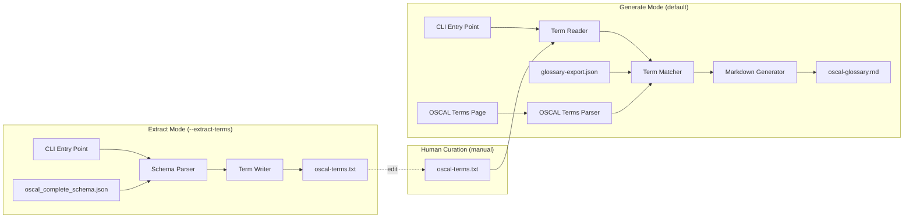

# Design Document: OSCAL Glossary Generator

## Overview

The OSCAL Glossary Generator is a build-time Python utility script (`bin/generate_oscal_glossary.py`) that produces a markdown glossary of OSCAL object types with definitions sourced from two complementary sources: the OSCAL terminology page (priority) and the NIST CSRC glossary (secondary). It bridges the gap between OSCAL's structured schema definitions and human-readable terminology by:

1. Parsing the OSCAL complete JSON schema to extract non-primitive object type definitions
2. Writing extracted terms to a curated term list file for human review
3. Reading terms from the curated term list file
4. Parsing the OSCAL terminology page for authoritative OSCAL-specific definitions
5. Matching terms against the OSCAL terminology page (priority) and the NIST CSRC glossary (fallback)
6. Generating a well-formatted markdown glossary with definitions, source annotations, and links

The script supports a two-step workflow with a human-in-the-loop curation stage:

- **Extract Mode** (`--extract-terms`): Parses the OSCAL schema and writes extracted object type short names to a Term List File (`data/oscal-terms.txt`). The user can then edit this file — removing noisy terms, adding custom terms, or fixing names to improve matching.
- **Generate Mode** (default): Reads terms from the Term List File, parses the OSCAL terminology page, loads the NIST glossary, matches terms against both sources with OSCAL page priority, and produces the Markdown Glossary with Definition_Source annotations.

The script follows the same pattern as existing build-time utilities in `bin/` (e.g., `build_oscal_db.py`, `update_hashes.py`) and is invoked via `hatch run bin/generate_oscal_glossary.py`. The output file (`data/oscal_docs/oscal-glossary.md`) becomes a bundled project resource.

## Architecture

The script is a standalone CLI utility with two operational modes arranged as separate pipelines:



### Component Responsibilities

- **CLI Entry Point** (`main()`): Parses `argparse` arguments (`--output`, `--schema`, `--glossary`, `--terms`, `--extract-terms`, `--oscal-terms-page`, `--verbose`), selects the operational mode, orchestrates the appropriate pipeline, handles top-level error reporting, and sets the exit code.
- **Schema Parser** (`parse_schema()`): Loads the OSCAL complete JSON schema, iterates over `definitions`, classifies each as Object_Type or Scalar_Type, extracts and deduplicates short names.
- **Term Writer** (`extract_terms()`): Writes the sorted, deduplicated short names to the Term List File with a comment header.
- **Term Reader** (`read_terms()`): Reads the Term List File, skips comments and blank lines, strips whitespace, deduplicates, and returns a list of short names.
- **OSCAL Terms Parser** (`parse_oscal_terms_page()`): Parses the Hugo-format OSCAL terminology markdown file, extracting term names from `###` headings and their definitions from subsequent prose paragraphs and callout blocks, while skipping front matter and todo blocks.
- **Term Matcher** (`match_terms()`): Matches short names against both the OSCAL terms page index (priority) and the NIST glossary index (fallback), using hyphen-to-space conversion and case-insensitive lookup. Records the Definition_Source for each matched term.
- **Markdown Generator** (`generate_markdown()`): Renders matched and unmatched terms into a structured markdown file with headings, definitions, Definition_Source annotations, source references, links, and a timestamp.

### Design Decisions

1. **Single-file script**: The generator lives in `bin/generate_oscal_glossary.py` as a self-contained script, consistent with other `bin/` utilities. No new package modules are needed since this is a build-time tool, not a runtime MCP tool.
2. **No external dependencies beyond stdlib**: The script uses only `json`, `argparse`, `logging`, `pathlib`, `re`, `datetime`, and `sys` — all stdlib. No new pip dependencies required.
3. **Deterministic output**: The markdown output is fully deterministic for the same inputs (excluding the timestamp line), enabling byte-identical comparison for CI validation.
4. **Two-step workflow with human curation**: Splitting extraction from generation allows users to curate the term list — removing noisy terms, adding custom terms not in the schema, or fixing term names to improve matching. This is more flexible than a single-pass pipeline.
5. **Simple term list format**: The Term List File uses plain text with one term per line, `#` comments, and blank line separators. This is easy to edit in any text editor and easy to diff in version control.
6. **OSCAL page priority over NIST**: When a term is defined in both the OSCAL terminology page and the NIST CSRC glossary, the OSCAL page definition takes priority because it is more specific to the OSCAL context. A WARNING-level log message is emitted when an override occurs, providing visibility into source conflicts.
7. **Graceful degradation for missing OSCAL page**: If the OSCAL terminology page file is missing, the generator logs a warning and continues using only the NIST glossary. This ensures backward compatibility and allows the generator to work even when the OSCAL documentation is not available locally.

## Components and Interfaces

### `parse_schema(schema_path: Path) -> list[str]`

Loads the OSCAL complete JSON schema and returns a deduplicated, sorted list of short names for all Object_Type definitions.

**Algorithm:**
1. Load and parse JSON from `schema_path`
2. Validate presence of `definitions` key
3. For each definition entry:
   - If `"type": "object"` is present → Object_Type
   - If `anyOf`/`oneOf` contains at least one variant with `"type": "object"` → Object_Type
   - If the entry is a `$ref`-only alias (no `type`, no `properties`, no `anyOf`/`oneOf` with objects) → Scalar_Type (skip)
   - If `type` is `string`, `integer`, `boolean`, `number` → Scalar_Type (skip)
4. Strip namespace prefix (everything before and including `:`) to get short name
5. Deduplicate by short name, keeping first occurrence
6. Return sorted list of unique short names

**Raises:** `SystemExit` on missing file, invalid JSON, or missing `definitions` key.

### `extract_terms(short_names: list[str], terms_path: Path) -> None`

Writes the extracted short names to the Term List File.

**Algorithm:**
1. Create the output directory (including intermediates) if it doesn't exist
2. Write a comment header line with `#` describing the file purpose and ISO 8601 generation timestamp
3. Write each short name on its own line, sorted alphabetically, with no blank lines between terms

**Raises:** `SystemExit` on write failure (permissions, disk full).

### `read_terms(terms_path: Path) -> list[str]`

Reads terms from the Term List File and returns a deduplicated list of short names.

**Algorithm:**
1. Load the file, exit with error if missing (advising user to run `--extract-terms` first)
2. For each line:
   - Strip leading and trailing whitespace
   - Skip blank lines (lines containing only whitespace)
   - Skip comment lines (lines starting with `#` after stripping)
   - Otherwise, treat the line as a term (hyphenated short name)
3. Deduplicate terms, retaining only the first occurrence (case-sensitive comparison)
4. Exit with error if no valid terms found

**Raises:** `SystemExit` on missing file, or file with no valid terms.

### `parse_oscal_terms_page(page_path: Path) -> dict[str, str]`

Parses the Hugo-format OSCAL terminology markdown file and returns a case-insensitive index of term names to definition text.

**Returns:** `dict` mapping lowercase term names to their definition text (prose paragraphs + callout content, with Hugo shortcode delimiters stripped).

**Algorithm:**
1. Load the file; if missing, log a WARNING and return an empty dict (graceful degradation)
2. Skip the Hugo front matter block (YAML between opening `---` and closing `---` markers at the top of the file)
3. Parse the remaining content line by line:
   - When a `###` heading is encountered (but not `####` or deeper): start a new term entry using the heading text as the term name
   - When a `####` or deeper heading is encountered: treat as a sub-section of the current term (content continues to accumulate under the current `###` term)
   - When a `##` heading is encountered: close the current term (section boundary)
   - When a `` opening marker is encountered: enter "skip mode" — discard all content until the matching `` closing marker
   - When a `{}` or `` opening marker is encountered: strip the delimiter and continue collecting content
   - When a `{}` or `` closing marker is encountered: strip the delimiter and continue
   - All other lines (prose paragraphs, blockquotes, links, images, etc.): accumulate as part of the current term's definition text
4. For each collected term, join the accumulated lines into a single definition string (preserving paragraph structure)
5. Build the index by normalizing each term name to lowercase
6. If the file exists but contains no parseable `###` headings, log a WARNING and return an empty dict

**Raises:** Nothing — this function degrades gracefully. Missing file or no headings result in warnings and an empty dict.

**Parsing details derived from the actual OSCAL terminology page:**

The file at `data/oscal_docs/OSCAL-Pages-main/src/content/learn/concepts/terminology/_index.md` has this structure:
- Hugo YAML front matter between `---` markers (title, date, weight, aliases, toc config)
- Introductory prose (before any `##` heading) — not associated with any term
- `##` headings define sections (e.g., "Control Definition", "Implementation", "Assessment") — these are section boundaries, not terms
- `###` headings define terms (e.g., "Control", "Catalog", "Baseline") — these are the terms to extract
- `####` headings are sub-sections within a term (e.g., "Examples of Controls and Catalogs") — content under these still belongs to the parent `###` term
- `{}...{}` blocks contain supplementary quotes and references — include in definition
- `...` blocks (angle-bracket variant) — same treatment as percent-bracket variant
- `...` blocks contain incomplete placeholder content — skip entirely
- Image references (``), markdown links, blockquotes, bold/italic — preserved as-is in definition text

### `load_glossary(glossary_path: Path) -> dict[str, dict]`

Loads the NIST CSRC glossary export and returns a case-insensitive lookup dictionary.

**Returns:** `dict` mapping lowercase term strings to their full `parentTerms` entry (with `term`, `link`, `definitions`, `abbrSyn` fields).

**Algorithm:**
1. Load and parse JSON from `glossary_path`
2. Validate presence of `parentTerms` array
3. Index each entry by `entry["term"].lower()` → full entry dict

**Raises:** `SystemExit` on missing file, invalid JSON, or missing `parentTerms`.

### `match_terms(short_names: list[str], glossary: dict[str, dict], oscal_terms: dict[str, str] | None = None) -> tuple[list[MatchedTerm], list[str]]`

Matches OSCAL short names against both the OSCAL terms page index (priority) and the NIST glossary index (fallback).

**Algorithm:**
1. For each short name, convert hyphens to spaces and normalize to lowercase for lookup
2. **Priority lookup**: Check the `oscal_terms` dict first (if provided and non-empty):
   - If found → create a Matched_Term with `source="OSCAL Page"`, the definition text from the OSCAL page, and no CSRC link/abbrSyn
   - If the term also exists in the NIST glossary with non-empty definitions, log a WARNING indicating the OSCAL page definition is overriding the NIST definition
3. **Fallback lookup**: If not found in `oscal_terms`, check the NIST glossary:
   - If found and `definitions` is non-null and non-empty → create a Matched_Term with `source="NIST CSRC"`
   - Otherwise → Unmatched_Term
4. Log a summary: matched count, unmatched count, OSCAL page source count, NIST source count, override count, total processed

**Returns:** Tuple of (matched terms list, unmatched short names list).

### `generate_markdown(matched: list[MatchedTerm], unmatched: list[str], output_path: Path) -> None`

Renders the glossary to a markdown file.

**Sections:**
1. Level-1 heading + intro paragraph (referencing both OSCAL terminology page and NIST CSRC glossary) + ISO 8601 timestamp
2. Matched terms (alphabetical by Human_Readable_Name), each with:
   - Level-2 heading (Human_Readable_Name)
   - "Also known as:" line if `abbrSyn` is present (NIST-sourced terms only)
   - Definition text (single text block for OSCAL-sourced terms, or numbered definitions for NIST-sourced terms with inline source references)
   - CSRC glossary link (NIST-sourced terms only)
   - Definition_Source annotation: `*Source: OSCAL Page*` or `*Source: NIST CSRC*`
3. Level-2 "Unmatched Terms" heading + alphabetical bulleted list

### `to_human_readable(short_name: str) -> str`

Converts a hyphenated short name to title-cased display name.
Example: `back-matter` → `Back Matter`

### `main() -> None`

CLI entry point that selects the operational mode based on arguments.

**Algorithm:**
1. Parse arguments: `--output`, `--schema`, `--glossary`, `--terms`, `--extract-terms`, `--oscal-terms-page`, `--verbose`
2. If `--extract-terms` is set (Extract Mode):
   - Call `parse_schema(args.schema)` to get short names
   - Call `extract_terms(short_names, args.terms)` to write the Term List File
   - Ignore `--oscal-terms-page`, `--glossary`, and `--output` arguments
   - Log output path and count, exit 0
3. If `--extract-terms` is not set (Generate Mode):
   - Call `read_terms(args.terms)` to get short names from the Term List File
   - Call `parse_oscal_terms_page(args.oscal_terms_page)` to load OSCAL-specific definitions
   - Call `load_glossary(args.glossary)` to load the NIST glossary
   - Call `match_terms(short_names, glossary, oscal_terms)` to classify terms with priority logic
   - Call `generate_markdown(matched, unmatched, args.output)` to write the glossary
   - Log output path, matched count, unmatched count, exit 0

### Data Types

```python
@dataclass
class MatchedTerm:
    short_name: str           # e.g., "back-matter"
    human_name: str           # e.g., "Back Matter"
    definitions: list[dict]   # From NIST glossary definitions array (NIST-sourced)
    link: str                 # CSRC glossary URL (empty for OSCAL-sourced terms)
    abbr_syn: list[dict] | None  # Abbreviations/synonyms if present (NIST-sourced)
    source: str = "NIST CSRC"    # Definition_Source: "OSCAL Page" or "NIST CSRC"
    oscal_definition: str = ""   # Plain text definition from OSCAL page (OSCAL-sourced)
```

The `source` field indicates the origin of the definition:
- `"OSCAL Page"` — definition came from the OSCAL terminology page; `oscal_definition` contains the text, `definitions` is empty, `link` is empty
- `"NIST CSRC"` — definition came from the NIST CSRC glossary; `definitions` contains the structured definitions, `link` contains the CSRC URL

## Data Models

### OSCAL Complete Schema Structure (Input)

The schema at `src/mcp_server_for_oscal/oscal_schemas/oscal_complete_schema.json` is a JSON Schema draft-07 document. Key structure:

```json
{
  "$schema": "http://json-schema.org/draft-07/schema#",
  "definitions": {
    "oscal-complete-oscal-catalog:catalog": {
      "type": "object",
      "properties": { ... }
    },
    "UUIDDatatype": {
      "type": "string",
      "pattern": "..."
    },
    "oscal-complete-oscal-control-common:parameter": {
      "type": "object",
      "anyOf": [ ... ]
    }
  }
}
```

- Namespaced keys: `oscal-complete-oscal-catalog:catalog` → short name `catalog`
- Non-namespaced keys: `UUIDDatatype`, `Base64Datatype`, `include-all`
- Object types have `"type": "object"` or `anyOf`/`oneOf` with object variants
- Scalar types have `"type": "string"` (or other primitives) or are `$ref`-only aliases

### NIST Glossary Structure (Input)

The glossary at `data/glossary-export.json`:

```json
{
  "totalRecords": 9870,
  "parentTerms": [
    {
      "term": "Access Control",
      "link": "https://csrc.nist.gov/glossary/term/access_control",
      "definitions": [
        {
          "text": "The process of granting or denying...",
          "sources": [
            {
              "text": "NIST SP 800-53 Rev. 5",
              "link": "https://doi.org/10.6028/NIST.SP.800-53r5"
            }
          ]
        }
      ],
      "abbrSyn": [
        { "text": "AC", "link": "..." }
      ]
    }
  ]
}
```

- `definitions` can be `null`, an empty array, or an array of definition objects
- Each definition has `text` and `sources` (array of `{text, link}`)
- `abbrSyn` is optional, contains abbreviations/synonyms

### OSCAL Terminology Page Structure (Input)

The OSCAL terminology page at `data/oscal_docs/OSCAL-Pages-main/src/content/learn/concepts/terminology/_index.md` is a Hugo-format markdown file:

```markdown
---
title: Key Concepts and Terms Used in OSCAL
date: 2020-04-23 16:34:04 -0400
weight: 10
aliases:
 - /concepts/terminology/
---

Introductory prose (not part of any term)...

## Control Definition

Section intro prose (not a term)...

### Control

Many privacy and security compliance programs are based on or make use of **controls**.

In OSCAL, a control is *a requirement or guideline...*

{}
A **security control** is defined in NIST SP 800-53...
> The safeguards or countermeasures prescribed...
{}


#### Control Objective
TODO


#### Examples of Controls and Catalogs

Each control has an associated definition...

### Catalog

Framework providers organize control requirements into a **catalog**.

### Baseline

A baseline defines a specific set of selected security control requirements...

NIST SP 800-37 defines a baseline as...
```

Key structural elements:
- **Hugo front matter**: YAML between `---` markers — skipped during parsing
- **`##` headings**: Section boundaries (e.g., "Control Definition") — not terms, but close the preceding `###` term
- **`###` headings**: Top-level term names (e.g., "Control", "Catalog", "Baseline") — these are extracted as terms
- **`####` headings**: Sub-sections within a term (e.g., "Examples of Controls and Catalogs") — content belongs to parent `###` term
- **`{}` / ``**: Supplementary content blocks — included in definition, delimiters stripped
- **``**: Incomplete placeholder content — skipped entirely (inclusive of delimiters)
- **Prose paragraphs**: Definition text — collected between heading boundaries

### Term List File Structure (Input/Output)

The term list file at `data/oscal-terms.txt`:

```text
# OSCAL object type terms extracted from oscal_complete_schema.json
# Generated: 2024-01-15T10:30:00Z
assessment-assets
assessment-part
assessment-platform
back-matter
catalog
control
```

- Plain text, one term per line
- Lines starting with `#` are comments (ignored during reading)
- Blank lines are separators (ignored during reading)
- Terms are hyphenated short names (e.g., `back-matter`, `system-security-plan`)
- Terms may contain hyphens, lowercase letters, uppercase letters, and digits

### Markdown Glossary Structure (Output)

```markdown
# OSCAL Glossary

Definitions sourced from the [OSCAL Terminology Page](https://pages.nist.gov/OSCAL/learn/concepts/terminology/) and the [NIST CSRC Glossary](https://csrc.nist.gov/glossary).

*Generated: 2024-01-15T10:30:00Z*

## Catalog

Framework providers organize control requirements into a **catalog**.
The OSCAL catalog model is designed to represent control requirement information...

*Source: OSCAL Page*

---

## Access Control

**Also known as:** AC

1. The process of granting or denying...
   *Source: [NIST SP 800-53 Rev. 5](https://doi.org/...)*

[CSRC Glossary: Access Control](https://csrc.nist.gov/glossary/term/access_control)

*Source: NIST CSRC*

---

## Unmatched Terms

The following OSCAL object types did not have matching entries in the OSCAL terminology page or the NIST CSRC glossary:

- Include All
- Select Control
```

## Correctness Properties

*A property is a characteristic or behavior that should hold true across all valid executions of a system — essentially, a formal statement about what the system should do. Properties serve as the bridge between human-readable specifications and machine-verifiable correctness guarantees.*

### Property 1: Object Type Classification

*For any* JSON schema definition entry that has `"type": "object"` or contains `anyOf`/`oneOf` with at least one object-typed variant, the Schema Parser SHALL classify it as an Object_Type and include it in the output.

**Validates: Requirements 1.3**

### Property 2: Scalar Type Exclusion

*For any* JSON schema definition entry that resolves to a scalar type (`string`, `integer`, `boolean`, `number`), or is a `$ref`-only alias without `properties`/`anyOf`/`oneOf` containing object variants, the Schema Parser SHALL exclude it from the output.

**Validates: Requirements 1.4**

### Property 3: Namespace Prefix Stripping

*For any* definition key containing a colon, the extracted short name SHALL equal the substring after the last colon. For any definition key without a colon, the short name SHALL equal the full key.

**Validates: Requirements 1.5**

### Property 4: Short Name Deduplication

*For any* list of definition keys where multiple keys resolve to the same short name, the output SHALL contain exactly one entry per unique short name, and the total count of output entries SHALL equal the count of unique short names.

**Validates: Requirements 1.6**

### Property 5: Case-Insensitive Glossary Indexing

*For any* glossary entry with term `T`, looking up the index with any case variant of `T` (uppercase, lowercase, mixed) SHALL return the same entry.

**Validates: Requirements 2.2, 2.3**

### Property 6: Term Matching Classification

*For any* OSCAL short name, converting hyphens to spaces and performing a case-insensitive lookup against the glossary SHALL classify the term as Matched_Term if and only if the glossary contains a matching entry with a non-null, non-empty `definitions` array. Otherwise it SHALL be classified as Unmatched_Term.

**Validates: Requirements 3.1, 3.3, 3.4, 3.5**

### Property 7: Alphabetical Ordering

*For any* set of matched terms in the generated markdown, the terms SHALL appear in case-insensitive alphabetical order by Human_Readable_Name.

**Validates: Requirements 4.3**

### Property 8: Matched Term Rendering Completeness

*For any* matched term with N definitions, the rendered markdown section SHALL contain the Human_Readable_Name as a level-2 heading, N numbered definition entries each with inline source references, and a hyperlink to the CSRC glossary page.

**Validates: Requirements 4.4, 4.5**

### Property 9: Abbreviation/Synonym Rendering

*For any* matched term that has a non-empty `abbrSyn` field, the rendered markdown SHALL include an "Also known as:" line listing all abbreviations/synonyms as a comma-separated list, placed before the definitions.

**Validates: Requirements 4.6**

### Property 10: Glossary Entry Completeness Invariant

*For any* set of terms read from the Term_List_File, the generated markdown SHALL contain exactly one entry per term — either in the matched terms section or the unmatched terms section — and the total count of entries (matched + unmatched) SHALL equal the count of input terms.

**Validates: Requirements 6.1, 6.2**

### Property 11: Definition and Link Fidelity

*For any* matched term, the definition text in the generated markdown SHALL be a character-for-character reproduction of the `text` field from the NIST glossary (with only HTML tag removal permitted), the CSRC link SHALL exactly reproduce the `link` field, and each source reference SHALL reproduce the `text` and `link` fields from the corresponding `sources` entry.

**Validates: Requirements 6.3, 6.4**

### Property 12: Deterministic Output

*For any* pair of runs on the same input terms, OSCAL terms page, and NIST glossary, the generated markdown output SHALL be byte-identical after excluding the generation timestamp line.

**Validates: Requirements 6.5**

### Property 13: Term List File Round Trip

*For any* sorted, deduplicated list of valid short names, writing them with `extract_terms()` and then reading them back with `read_terms()` SHALL produce an identical list with no terms lost or added.

**Validates: Requirements 10.5**

### Property 14: Term List Reading Correctness

*For any* Term_List_File containing a mix of valid term lines, comment lines (starting with `#`), blank lines, and duplicate terms, `read_terms()` SHALL return only the valid terms (skipping comments and blanks), deduplicated by first occurrence, with leading and trailing whitespace stripped from each term.

**Validates: Requirements 8.2, 8.3, 8.4**

### Property 15: OSCAL Page Term Extraction

*For any* Hugo-format markdown file containing `###` headings and `####` headings, `parse_oscal_terms_page()` SHALL return a dict whose keys are the lowercase text of each `###` heading, and SHALL NOT include `####` (or deeper) headings as top-level keys. The dict keys SHALL be normalized to lowercase for case-insensitive matching.

**Validates: Requirements 11.3, 11.4, 11.8**

### Property 16: OSCAL Page Definition Assembly

*For any* Hugo-format markdown file with `###` headings followed by prose paragraphs, callout blocks, and todo blocks, `parse_oscal_terms_page()` SHALL return definitions that include all prose paragraphs and callout content (with Hugo shortcode delimiters stripped), SHALL exclude all content within `...` blocks, and SHALL exclude Hugo front matter content.

**Validates: Requirements 11.2, 11.5, 11.6, 11.7**

### Property 17: Dual-Source Term Matching Priority

*For any* set of OSCAL short names, OSCAL terms page index, and NIST glossary index, `match_terms()` SHALL:
- Use the OSCAL page definition when a term exists in the OSCAL terms page, regardless of whether it also exists in the NIST glossary, and set `source="OSCAL Page"`
- Fall back to the NIST glossary definition when a term is not in the OSCAL terms page but exists in the NIST glossary with non-empty definitions, and set `source="NIST CSRC"`
- Classify a term as Unmatched_Term when it exists in neither source (or only in the NIST glossary with null/empty definitions)

**Validates: Requirements 3.2, 12.1, 12.3, 12.4, 13.1, 13.2, 13.3**

## Error Handling

### Input Validation Errors

| Error Condition | Behavior | Exit Code |
|---|---|---|
| Schema file missing | Log error with file path, exit | 1 |
| Schema file invalid JSON | Log error with path + parse error, exit | 1 |
| Schema missing `definitions` key | Log error indicating missing section, exit | 1 |
| Glossary file missing | Log error with file path, exit | 1 |
| Glossary file invalid JSON | Log error with path + parse error, exit | 1 |
| Glossary missing `parentTerms` | Log error indicating expected structure, exit | 1 |
| Term List File missing | Log error with file path, advise running `--extract-terms` first, exit | 1 |
| Term List File has no valid terms | Log error indicating file contains no terms, exit | 1 |
| OSCAL Terms Page missing | Log WARNING with file path, continue with NIST glossary only | N/A (degraded) |
| OSCAL Terms Page has no `###` headings | Log WARNING, continue with NIST glossary only | N/A (degraded) |

### Output Errors

| Error Condition | Behavior | Exit Code |
|---|---|---|
| Output directory doesn't exist | Create directory (including intermediates) via `Path.mkdir(parents=True, exist_ok=True)` | N/A (recovered) |
| Term List File directory doesn't exist | Create directory (including intermediates) via `Path.mkdir(parents=True, exist_ok=True)` | N/A (recovered) |
| Cannot write output file | Log error with path + reason (permissions, disk full), exit | 1 |
| Cannot write Term List File | Log error with path + reason (permissions, disk full), exit | 1 |

### Error Implementation Pattern

```python
def _fatal(msg: str) -> NoReturn:
    """Log a fatal error and exit with status 1."""
    logger.error(msg)
    sys.exit(1)
```

All error paths use `sys.exit(1)` for non-zero exit codes, consistent with the `build_oscal_db.py` pattern. Error messages always include the file path and a description of the failure. The OSCAL terms page uses graceful degradation (warning + continue) rather than fatal errors, since it is an optional enhancement to the glossary.

## Testing Strategy

### Unit Tests (pytest)

Unit tests cover specific examples, edge cases, and error conditions:

- **Schema parsing edge cases**: Missing file, invalid JSON, missing `definitions` key, schema with only scalar types, schema with mixed object/scalar types
- **Glossary loading edge cases**: Missing file, invalid JSON, missing `parentTerms`, entries with null/empty definitions
- **Term matching edge cases**: Terms with null definitions (classified as unmatched), no matches found, all terms matched, OSCAL page override logging, mixed OSCAL/NIST sources
- **OSCAL terms page parsing**: Missing file (warning + empty dict), file with no `###` headings (warning + empty dict), front matter skipping, callout block inclusion, todo block exclusion, `####` sub-section handling, real OSCAL terminology page smoke test
- **Term extraction**: Verify output file format (comment header, sorted terms, no blank lines between terms), directory creation
- **Term reading**: Missing file error with `--extract-terms` advice, empty file error, files with only comments/blanks, whitespace stripping
- **Markdown rendering**: Header structure validation, unmatched terms bulleted list, output directory creation, Definition_Source annotations for both OSCAL and NIST sources, OSCAL-sourced term rendering (no CSRC link, no numbered definitions)
- **CLI**: Default argument values, `--help` output, unrecognized arguments, `--verbose` logging, exit codes, `--extract-terms` mode selection, `--terms` argument, `--oscal-terms-page` argument and default, `--extract-terms` ignoring `--oscal-terms-page`/`--glossary`/`--output`

### Property-Based Tests (Hypothesis)

Property-based tests verify the 17 correctness properties using the `hypothesis` library (already a project dev dependency). Each property test runs a minimum of 100 iterations.

**Library**: `hypothesis` (already in `pyproject.toml` devtest group)

**Test file**: `tests/test_glossary_generator_properties.py`

**Configuration**:
```python
from hypothesis import given, settings, HealthCheck
from hypothesis import strategies as st

@settings(max_examples=100, deadline=None)
```

**Tag format**: Each test is tagged with a docstring comment:
```
Feature: oscal-glossary-generator, Property {N}: {property_text}
```

**Hypothesis strategies needed**:
- `schema_definition_entry()`: Generates random JSON schema definition entries (object types, scalar types, $ref-only aliases, anyOf/oneOf variants)
- `definition_key()`: Generates random namespaced and non-namespaced definition keys
- `glossary_entry()`: Generates random NIST glossary entries with varying term names, definitions (including null/empty), sources, and abbrSyn
- `matched_term()`: Generates random MatchedTerm instances for rendering tests
- `valid_short_name()`: Generates random valid short names (hyphenated, lowercase/uppercase letters, digits) for term list file tests
- `term_list_file_content()`: Generates random term list file content with valid terms, comments, blank lines, and duplicates
- `hugo_markdown_file()`: Generates random Hugo-format markdown files with front matter, `##`/`###`/`####` headings, prose paragraphs, callout blocks, and todo blocks
- `oscal_terms_dict()`: Generates random OSCAL terms page index dicts (lowercase term → definition text)

**Property test mapping**:

| Property | Test Method | What Varies |
|---|---|---|
| 1: Object Type Classification | `test_object_type_classified` | Definition entry structure (type:object, anyOf, oneOf) |
| 2: Scalar Type Exclusion | `test_scalar_type_excluded` | Scalar entry structure (type:string, $ref-only) |
| 3: Namespace Stripping | `test_namespace_stripping` | Key format (with/without colon, varying prefixes) |
| 4: Deduplication | `test_deduplication_invariant` | Lists of keys with controlled short name collisions |
| 5: Case-Insensitive Index | `test_case_insensitive_lookup` | Term strings with mixed case |
| 6: Matching Classification | `test_matching_classification` | Short names, glossary entries with/without definitions |
| 7: Alphabetical Ordering | `test_alphabetical_ordering` | Sets of matched term names |
| 8: Rendering Completeness | `test_rendering_completeness` | Matched terms with varying definition counts |
| 9: AbbrSyn Rendering | `test_abbrsyn_rendering` | Matched terms with varying abbrSyn entries |
| 10: Completeness Invariant | `test_completeness_invariant` | Term list + glossary + OSCAL terms combinations |
| 11: Definition Fidelity | `test_definition_fidelity` | Definition texts with special characters, HTML |
| 12: Deterministic Output | `test_deterministic_output` | Random term list + glossary + OSCAL terms inputs, two runs |
| 13: Term List Round Trip | `test_term_list_round_trip` | Random lists of valid short names |
| 14: Term List Reading | `test_term_list_reading_correctness` | Files with comments, blanks, duplicates, whitespace |
| 15: OSCAL Page Term Extraction | `test_oscal_page_term_extraction` | Hugo markdown files with varying `###`/`####` headings |
| 16: OSCAL Page Definition Assembly | `test_oscal_page_definition_assembly` | Hugo markdown files with prose, callouts, todos, front matter |
| 17: Dual-Source Matching Priority | `test_dual_source_matching_priority` | Short names with varying presence in OSCAL page vs NIST glossary |
