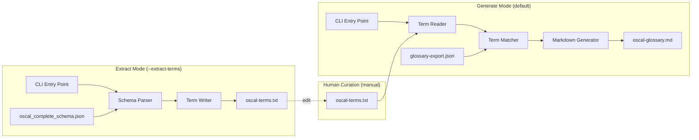

# Design Document: OSCAL Glossary Generator

## Overview

The OSCAL Glossary Generator is a build-time Python utility script (`bin/generate_oscal_glossary.py`) that produces a markdown glossary of OSCAL object types with definitions sourced from the NIST CSRC glossary. It bridges the gap between OSCAL's structured schema definitions and human-readable terminology by:

1. Parsing the OSCAL complete JSON schema to extract non-primitive object type definitions
2. Writing extracted terms to a curated term list file for human review
3. Reading terms from the curated term list file
4. Matching terms against the NIST CSRC glossary export
5. Generating a well-formatted markdown glossary with definitions, source references, and links

The script supports a two-step workflow with a human-in-the-loop curation stage:

- **Extract Mode** (`--extract-terms`): Parses the OSCAL schema and writes extracted object type short names to a Term List File (`data/oscal-terms.txt`). The user can then edit this file — removing noisy terms, adding custom terms, or fixing names to improve NIST glossary matching.
- **Generate Mode** (default): Reads terms from the Term List File, matches them against the NIST glossary, and produces the Markdown Glossary.

The script follows the same pattern as existing build-time utilities in `bin/` (e.g., `build_oscal_db.py`, `update_hashes.py`) and is invoked via `hatch run bin/generate_oscal_glossary.py`. The output file (`data/oscal_docs/oscal-glossary.md`) becomes a bundled project resource.

## Architecture

The script is a standalone CLI utility with two operational modes arranged as separate pipelines:



### Component Responsibilities

- **CLI Entry Point** (`main()`): Parses `argparse` arguments (`--output`, `--schema`, `--glossary`, `--terms`, `--extract-terms`, `--verbose`), selects the operational mode, orchestrates the appropriate pipeline, handles top-level error reporting, and sets the exit code.
- **Schema Parser** (`parse_schema()`): Loads the OSCAL complete JSON schema, iterates over `definitions`, classifies each as Object_Type or Scalar_Type, extracts and deduplicates short names.
- **Term Writer** (`extract_terms()`): Writes the sorted, deduplicated short names to the Term List File with a comment header.
- **Term Reader** (`read_terms()`): Reads the Term List File, skips comments and blank lines, strips whitespace, deduplicates, and returns a list of short names.
- **Term Matcher** (`match_terms()`): Loads the NIST glossary, builds a case-insensitive index by term, and matches short names (hyphen-to-space conversion) against the index.
- **Markdown Generator** (`generate_markdown()`): Renders matched and unmatched terms into a structured markdown file with headings, definitions, source references, links, and a timestamp.

### Design Decisions

1. **Single-file script**: The generator lives in `bin/generate_oscal_glossary.py` as a self-contained script, consistent with other `bin/` utilities. No new package modules are needed since this is a build-time tool, not a runtime MCP tool.
2. **No external dependencies beyond stdlib**: The script uses only `json`, `argparse`, `logging`, `pathlib`, `re`, `datetime`, and `sys` — all stdlib. No new pip dependencies required.
3. **Deterministic output**: The markdown output is fully deterministic for the same inputs (excluding the timestamp line), enabling byte-identical comparison for CI validation.
4. **Two-step workflow with human curation**: Splitting extraction from generation allows users to curate the term list — removing noisy terms, adding custom terms not in the schema, or fixing term names to improve NIST glossary matching. This is more flexible than a single-pass pipeline.
5. **Simple term list format**: The Term List File uses plain text with one term per line, `#` comments, and blank line separators. This is easy to edit in any text editor and easy to diff in version control.

## Components and Interfaces

### `parse_schema(schema_path: Path) -> list[str]`

Loads the OSCAL complete JSON schema and returns a deduplicated, sorted list of short names for all Object_Type definitions.

**Algorithm:**
1. Load and parse JSON from `schema_path`
2. Validate presence of `definitions` key
3. For each definition entry:
   - If `"type": "object"` is present → Object_Type
   - If `anyOf`/`oneOf` contains at least one variant with `"type": "object"` → Object_Type
   - If the entry is a `$ref`-only alias (no `type`, no `properties`, no `anyOf`/`oneOf` with objects) → Scalar_Type (skip)
   - If `type` is `string`, `integer`, `boolean`, `number` → Scalar_Type (skip)
4. Strip namespace prefix (everything before and including `:`) to get short name
5. Deduplicate by short name, keeping first occurrence
6. Return sorted list of unique short names

**Raises:** `SystemExit` on missing file, invalid JSON, or missing `definitions` key.

### `extract_terms(short_names: list[str], terms_path: Path) -> None`

Writes the extracted short names to the Term List File.

**Algorithm:**
1. Create the output directory (including intermediates) if it doesn't exist
2. Write a comment header line with `#` describing the file purpose and ISO 8601 generation timestamp
3. Write each short name on its own line, sorted alphabetically, with no blank lines between terms

**Raises:** `SystemExit` on write failure (permissions, disk full).

### `read_terms(terms_path: Path) -> list[str]`

Reads terms from the Term List File and returns a deduplicated list of short names.

**Algorithm:**
1. Load the file, exit with error if missing (advising user to run `--extract-terms` first)
2. For each line:
   - Strip leading and trailing whitespace
   - Skip blank lines (lines containing only whitespace)
   - Skip comment lines (lines starting with `#` after stripping)
   - Otherwise, treat the line as a term (hyphenated short name)
3. Deduplicate terms, retaining only the first occurrence (case-sensitive comparison)
4. Exit with error if no valid terms found

**Raises:** `SystemExit` on missing file, or file with no valid terms.

### `load_glossary(glossary_path: Path) -> dict[str, dict]`

Loads the NIST CSRC glossary export and returns a case-insensitive lookup dictionary.

**Returns:** `dict` mapping lowercase term strings to their full `parentTerms` entry (with `term`, `link`, `definitions`, `abbrSyn` fields).

**Algorithm:**
1. Load and parse JSON from `glossary_path`
2. Validate presence of `parentTerms` array
3. Index each entry by `entry["term"].lower()` → full entry dict

**Raises:** `SystemExit` on missing file, invalid JSON, or missing `parentTerms`.

### `match_terms(short_names: list[str], glossary: dict[str, dict]) -> tuple[list[MatchedTerm], list[str]]`

Matches OSCAL short names against the glossary index.

**Algorithm:**
1. For each short name, convert hyphens to spaces and look up in glossary (case-insensitive)
2. If found and `definitions` is non-null and non-empty → Matched_Term
3. Otherwise → Unmatched_Term

**Returns:** Tuple of (matched terms list, unmatched short names list).

### `generate_markdown(matched: list[MatchedTerm], unmatched: list[str], output_path: Path) -> None`

Renders the glossary to a markdown file.

**Sections:**
1. Level-1 heading + intro paragraph + ISO 8601 timestamp
2. Matched terms (alphabetical by Human_Readable_Name), each with:
   - Level-2 heading (Human_Readable_Name)
   - "Also known as:" line if `abbrSyn` is present
   - Numbered definitions with inline source references
   - CSRC glossary link
3. Level-2 "Unmatched Terms" heading + alphabetical bulleted list

### `to_human_readable(short_name: str) -> str`

Converts a hyphenated short name to title-cased display name.
Example: `back-matter` → `Back Matter`

### `main() -> None`

CLI entry point that selects the operational mode based on arguments.

**Algorithm:**
1. Parse arguments: `--output`, `--schema`, `--glossary`, `--terms`, `--extract-terms`, `--verbose`
2. If `--extract-terms` is set (Extract Mode):
   - Call `parse_schema(args.schema)` to get short names
   - Call `extract_terms(short_names, args.terms)` to write the Term List File
   - Log output path and count, exit 0
3. If `--extract-terms` is not set (Generate Mode):
   - Call `read_terms(args.terms)` to get short names from the Term List File
   - Call `load_glossary(args.glossary)` to load the NIST glossary
   - Call `match_terms(short_names, glossary)` to classify terms
   - Call `generate_markdown(matched, unmatched, args.output)` to write the glossary
   - Log output path, matched count, unmatched count, exit 0

### Data Types

```python
@dataclass
class MatchedTerm:
    short_name: str           # e.g., "back-matter"
    human_name: str           # e.g., "Back Matter"
    definitions: list[dict]   # From NIST glossary definitions array
    link: str                 # CSRC glossary URL
    abbr_syn: list[dict] | None  # Abbreviations/synonyms if present
```

## Data Models

### OSCAL Complete Schema Structure (Input)

The schema at `src/mcp_server_for_oscal/oscal_schemas/oscal_complete_schema.json` is a JSON Schema draft-07 document. Key structure:

```json
{
  "$schema": "http://json-schema.org/draft-07/schema#",
  "definitions": {
    "oscal-complete-oscal-catalog:catalog": {
      "type": "object",
      "properties": { ... }
    },
    "UUIDDatatype": {
      "type": "string",
      "pattern": "..."
    },
    "oscal-complete-oscal-control-common:parameter": {
      "type": "object",
      "anyOf": [ ... ]
    }
  }
}
```

- Namespaced keys: `oscal-complete-oscal-catalog:catalog` → short name `catalog`
- Non-namespaced keys: `UUIDDatatype`, `Base64Datatype`, `include-all`
- Object types have `"type": "object"` or `anyOf`/`oneOf` with object variants
- Scalar types have `"type": "string"` (or other primitives) or are `$ref`-only aliases

### NIST Glossary Structure (Input)

The glossary at `data/glossary-export.json`:

```json
{
  "totalRecords": 9870,
  "parentTerms": [
    {
      "term": "Access Control",
      "link": "https://csrc.nist.gov/glossary/term/access_control",
      "definitions": [
        {
          "text": "The process of granting or denying...",
          "sources": [
            {
              "text": "NIST SP 800-53 Rev. 5",
              "link": "https://doi.org/10.6028/NIST.SP.800-53r5"
            }
          ]
        }
      ],
      "abbrSyn": [
        { "text": "AC", "link": "..." }
      ]
    }
  ]
}
```

- `definitions` can be `null`, an empty array, or an array of definition objects
- Each definition has `text` and `sources` (array of `{text, link}`)
- `abbrSyn` is optional, contains abbreviations/synonyms

### Term List File Structure (Input/Output)

The term list file at `data/oscal-terms.txt`:

```text
# OSCAL object type terms extracted from oscal_complete_schema.json
# Generated: 2024-01-15T10:30:00Z
assessment-assets
assessment-part
assessment-platform
back-matter
catalog
control
```

- Plain text, one term per line
- Lines starting with `#` are comments (ignored during reading)
- Blank lines are separators (ignored during reading)
- Terms are hyphenated short names (e.g., `back-matter`, `system-security-plan`)
- Terms may contain hyphens, lowercase letters, uppercase letters, and digits

### Markdown Glossary Structure (Output)

```markdown
# OSCAL Glossary

Definitions sourced from the [NIST CSRC Glossary](https://csrc.nist.gov/glossary).

*Generated: 2024-01-15T10:30:00Z*

## Access Control

**Also known as:** AC

1. The process of granting or denying...
   *Source: [NIST SP 800-53 Rev. 5](https://doi.org/...)*

[CSRC Glossary: Access Control](https://csrc.nist.gov/glossary/term/access_control)

---

## Unmatched Terms

The following OSCAL object types did not have matching entries in the NIST CSRC glossary:

- Include All
- Select Control
```


## Correctness Properties

*A property is a characteristic or behavior that should hold true across all valid executions of a system — essentially, a formal statement about what the system should do. Properties serve as the bridge between human-readable specifications and machine-verifiable correctness guarantees.*

### Property 1: Object Type Classification

*For any* JSON schema definition entry that has `"type": "object"` or contains `anyOf`/`oneOf` with at least one object-typed variant, the Schema Parser SHALL classify it as an Object_Type and include it in the output.

**Validates: Requirements 1.3**

### Property 2: Scalar Type Exclusion

*For any* JSON schema definition entry that resolves to a scalar type (`string`, `integer`, `boolean`, `number`), or is a `$ref`-only alias without `properties`/`anyOf`/`oneOf` containing object variants, the Schema Parser SHALL exclude it from the output.

**Validates: Requirements 1.4**

### Property 3: Namespace Prefix Stripping

*For any* definition key containing a colon, the extracted short name SHALL equal the substring after the last colon. For any definition key without a colon, the short name SHALL equal the full key.

**Validates: Requirements 1.5**

### Property 4: Short Name Deduplication

*For any* list of definition keys where multiple keys resolve to the same short name, the output SHALL contain exactly one entry per unique short name, and the total count of output entries SHALL equal the count of unique short names.

**Validates: Requirements 1.6**

### Property 5: Case-Insensitive Glossary Indexing

*For any* glossary entry with term `T`, looking up the index with any case variant of `T` (uppercase, lowercase, mixed) SHALL return the same entry.

**Validates: Requirements 2.2, 2.3**

### Property 6: Term Matching Classification

*For any* OSCAL short name, converting hyphens to spaces and performing a case-insensitive lookup against the glossary SHALL classify the term as Matched_Term if and only if the glossary contains a matching entry with a non-null, non-empty `definitions` array. Otherwise it SHALL be classified as Unmatched_Term.

**Validates: Requirements 3.1, 3.2, 3.3, 3.4**

### Property 7: Alphabetical Ordering

*For any* set of matched terms in the generated markdown, the terms SHALL appear in case-insensitive alphabetical order by Human_Readable_Name.

**Validates: Requirements 4.3**

### Property 8: Matched Term Rendering Completeness

*For any* matched term with N definitions, the rendered markdown section SHALL contain the Human_Readable_Name as a level-2 heading, N numbered definition entries each with inline source references, and a hyperlink to the CSRC glossary page.

**Validates: Requirements 4.4, 4.5**

### Property 9: Abbreviation/Synonym Rendering

*For any* matched term that has a non-empty `abbrSyn` field, the rendered markdown SHALL include an "Also known as:" line listing all abbreviations/synonyms as a comma-separated list, placed before the definitions.

**Validates: Requirements 4.6**

### Property 10: Glossary Entry Completeness Invariant

*For any* set of terms read from the Term_List_File, the generated markdown SHALL contain exactly one entry per term — either in the matched terms section or the unmatched terms section — and the total count of entries (matched + unmatched) SHALL equal the count of input terms.

**Validates: Requirements 6.1, 6.2**

### Property 11: Definition and Link Fidelity

*For any* matched term, the definition text in the generated markdown SHALL be a character-for-character reproduction of the `text` field from the NIST glossary (with only HTML tag removal permitted), the CSRC link SHALL exactly reproduce the `link` field, and each source reference SHALL reproduce the `text` and `link` fields from the corresponding `sources` entry.

**Validates: Requirements 6.3, 6.4**

### Property 12: Deterministic Output

*For any* pair of runs on the same input terms and NIST glossary, the generated markdown output SHALL be byte-identical after excluding the generation timestamp line.

**Validates: Requirements 6.5**

### Property 13: Term List File Round Trip

*For any* sorted, deduplicated list of valid short names, writing them with `extract_terms()` and then reading them back with `read_terms()` SHALL produce an identical list with no terms lost or added.

**Validates: Requirements 10.5**

### Property 14: Term List Reading Correctness

*For any* Term_List_File containing a mix of valid term lines, comment lines (starting with `#`), blank lines, and duplicate terms, `read_terms()` SHALL return only the valid terms (skipping comments and blanks), deduplicated by first occurrence, with leading and trailing whitespace stripped from each term.

**Validates: Requirements 8.2, 8.3, 8.4**

## Error Handling

### Input Validation Errors

| Error Condition | Behavior | Exit Code |
|---|---|---|
| Schema file missing | Log error with file path, exit | 1 |
| Schema file invalid JSON | Log error with path + parse error, exit | 1 |
| Schema missing `definitions` key | Log error indicating missing section, exit | 1 |
| Glossary file missing | Log error with file path, exit | 1 |
| Glossary file invalid JSON | Log error with path + parse error, exit | 1 |
| Glossary missing `parentTerms` | Log error indicating expected structure, exit | 1 |
| Term List File missing | Log error with file path, advise running `--extract-terms` first, exit | 1 |
| Term List File has no valid terms | Log error indicating file contains no terms, exit | 1 |

### Output Errors

| Error Condition | Behavior | Exit Code |
|---|---|---|
| Output directory doesn't exist | Create directory (including intermediates) via `Path.mkdir(parents=True, exist_ok=True)` | N/A (recovered) |
| Term List File directory doesn't exist | Create directory (including intermediates) via `Path.mkdir(parents=True, exist_ok=True)` | N/A (recovered) |
| Cannot write output file | Log error with path + reason (permissions, disk full), exit | 1 |
| Cannot write Term List File | Log error with path + reason (permissions, disk full), exit | 1 |

### Error Implementation Pattern

```python
def _fatal(msg: str) -> NoReturn:
    """Log a fatal error and exit with status 1."""
    logger.error(msg)
    sys.exit(1)
```

All error paths use `sys.exit(1)` for non-zero exit codes, consistent with the `build_oscal_db.py` pattern. Error messages always include the file path and a description of the failure.

## Testing Strategy

### Unit Tests (pytest)

Unit tests cover specific examples, edge cases, and error conditions:

- **Schema parsing edge cases**: Missing file, invalid JSON, missing `definitions` key, schema with only scalar types, schema with mixed object/scalar types
- **Glossary loading edge cases**: Missing file, invalid JSON, missing `parentTerms`, entries with null/empty definitions
- **Term matching edge cases**: Terms with null definitions (classified as unmatched), no matches found, all terms matched
- **Term extraction**: Verify output file format (comment header, sorted terms, no blank lines between terms), directory creation
- **Term reading**: Missing file error with `--extract-terms` advice, empty file error, files with only comments/blanks, whitespace stripping
- **Markdown rendering**: Header structure validation, unmatched terms bulleted list, output directory creation
- **CLI**: Default argument values, `--help` output, unrecognized arguments, `--verbose` logging, exit codes, `--extract-terms` mode selection, `--terms` argument, `--extract-terms` ignoring `--glossary`/`--output`

### Property-Based Tests (Hypothesis)

Property-based tests verify the 14 correctness properties using the `hypothesis` library (already a project dev dependency). Each property test runs a minimum of 100 iterations.

**Library**: `hypothesis` (already in `pyproject.toml` devtest group)

**Test file**: `tests/test_glossary_generator_properties.py`

**Configuration**:
```python
from hypothesis import given, settings, HealthCheck
from hypothesis import strategies as st

@settings(max_examples=100, deadline=None)
```

**Tag format**: Each test is tagged with a docstring comment:
```
Feature: oscal-glossary-generator, Property {N}: {property_text}
```

**Hypothesis strategies needed**:
- `schema_definition_entry()`: Generates random JSON schema definition entries (object types, scalar types, $ref-only aliases, anyOf/oneOf variants)
- `definition_key()`: Generates random namespaced and non-namespaced definition keys
- `glossary_entry()`: Generates random NIST glossary entries with varying term names, definitions (including null/empty), sources, and abbrSyn
- `matched_term()`: Generates random MatchedTerm instances for rendering tests
- `valid_short_name()`: Generates random valid short names (hyphenated, lowercase/uppercase letters, digits) for term list file tests
- `term_list_file_content()`: Generates random term list file content with valid terms, comments, blank lines, and duplicates

**Property test mapping**:

| Property | Test Method | What Varies |
|---|---|---|
| 1: Object Type Classification | `test_object_type_classified` | Definition entry structure (type:object, anyOf, oneOf) |
| 2: Scalar Type Exclusion | `test_scalar_type_excluded` | Scalar entry structure (type:string, $ref-only) |
| 3: Namespace Stripping | `test_namespace_stripping` | Key format (with/without colon, varying prefixes) |
| 4: Deduplication | `test_deduplication_invariant` | Lists of keys with controlled short name collisions |
| 5: Case-Insensitive Index | `test_case_insensitive_lookup` | Term strings with mixed case |
| 6: Matching Classification | `test_matching_classification` | Short names, glossary entries with/without definitions |
| 7: Alphabetical Ordering | `test_alphabetical_ordering` | Sets of matched term names |
| 8: Rendering Completeness | `test_rendering_completeness` | Matched terms with varying definition counts |
| 9: AbbrSyn Rendering | `test_abbrsyn_rendering` | Matched terms with varying abbrSyn entries |
| 10: Completeness Invariant | `test_completeness_invariant` | Term list + glossary combinations |
| 11: Definition Fidelity | `test_definition_fidelity` | Definition texts with special characters, HTML |
| 12: Deterministic Output | `test_deterministic_output` | Random term list + glossary inputs, two runs |
| 13: Term List Round Trip | `test_term_list_round_trip` | Random lists of valid short names |
| 14: Term List Reading | `test_term_list_reading_correctness` | Files with comments, blanks, duplicates, whitespace |
