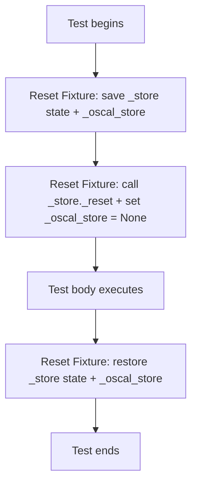

# Design Document: Parallel-Safe Tests

## Overview

The test suite for `mcp-server-for-oscal` cannot run in parallel because five tests in `tests/tools/test_query_component_definition.py` depend on shared mutable module-level singletons (`_store` and `_oscal_store`) in `query_component_definition.py`. When `pytest-xdist` distributes tests across workers, non-deterministic ordering causes tests that call `_store._reset()` to clear state needed by other tests.

The fix introduces an autouse fixture that saves, clears, and restores both singletons around every test, patches the five failing tests to explicitly set up the state they need, and enables `parallel = true` in `pyproject.toml`.

## Architecture

The solution is purely in the test layer — no production code changes are needed.



The fixture follows the same pattern already established in `tests/test_properties.py` for `_oscal_store`, extended to also cover `_store`.

### Key Design Decisions

1. **Deep copy for `_store` state, simple assignment for `_oscal_store`**: The `_store` singleton contains 9 mutable dictionaries and a stats dict. A deep copy is needed to prevent aliasing. The `_oscal_store` is a single reference (or None), so simple save/restore suffices.

2. **Fixture in the test file, not conftest.py**: The fixture is specific to `test_query_component_definition.py`. Placing it in the file's module scope (not inside a class) makes it autouse for all tests in that file. This mirrors the pattern in `test_properties.py`.

3. **Fix tests by adding `setup_component_defs_dir` fixture**: The five failing tests either lack the fixture entirely or create the directory but never call `_load_component_definitions_from_directory()`. The fix is to add the missing fixture dependency or add the missing load call.

## Components and Interfaces

### Component 1: Reset Fixture (`reset_store`)

Location: `tests/tools/test_query_component_definition.py` (module-level)

```python
import copy
from mcp_server_for_oscal.tools import query_component_definition as _qcd_module

@pytest.fixture(autouse=True)
def reset_store():
    """Save, clear, and restore _store and _oscal_store around each test."""
    # Save _store state (deep copy of all index dicts + stats)
    saved_cdefs_by_path = copy.deepcopy(_store._cdefs_by_path)
    saved_cdefs_by_uuid = copy.deepcopy(_store._cdefs_by_uuid)
    saved_cdefs_by_title = copy.deepcopy(_store._cdefs_by_title)
    saved_components_by_uuid = copy.deepcopy(_store._components_by_uuid)
    saved_components_by_title = copy.deepcopy(_store._components_by_title)
    saved_components_to_cdef = copy.deepcopy(_store._components_to_cdef_by_uuid)
    saved_capabilities_by_uuid = copy.deepcopy(_store._capabilities_by_uuid)
    saved_capabilities_by_name = copy.deepcopy(_store._capabilities_by_name)
    saved_capabilities_to_cdef = copy.deepcopy(_store._capabilities_to_cdef_by_uuid)
    saved_stats = copy.deepcopy(_store._stats)

    # Save _oscal_store
    saved_oscal_store = _qcd_module._oscal_store

    # Clear both singletons
    _store._reset()
    _qcd_module._oscal_store = None

    yield

    # Restore _store state
    _store._cdefs_by_path = saved_cdefs_by_path
    _store._cdefs_by_uuid = saved_cdefs_by_uuid
    _store._cdefs_by_title = saved_cdefs_by_title
    _store._components_by_uuid = saved_components_by_uuid
    _store._components_by_title = saved_components_by_title
    _store._components_to_cdef_by_uuid = saved_components_to_cdef
    _store._capabilities_by_uuid = saved_capabilities_by_uuid
    _store._capabilities_by_name = saved_capabilities_by_name
    _store._capabilities_to_cdef_by_uuid = saved_capabilities_to_cdef
    _store._stats = saved_stats

    # Restore _oscal_store
    _qcd_module._oscal_store = saved_oscal_store
```

### Component 2: Test Fixes

Five tests need modification:

| Test | Current Problem | Fix |
|------|----------------|-----|
| `test_query_by_type_not_found` | No `setup_component_defs_dir` fixture — relies on module-level `_store` being populated | Add `setup_component_defs_dir` fixture parameter |
| `test_query_invalid_query_type` | No store population — hits "No Component Definitions loaded" guard before reaching invalid query_type path | Add `setup_component_defs_dir` fixture parameter |
| `test_query_with_component_definition_filter_by_uuid` | Creates directory and patches config but never calls `_load_component_definitions_from_directory()` | Add `_load_component_definitions_from_directory()` call after config patch |
| `test_query_with_component_definition_filter_by_title` | Same as above | Add `_load_component_definitions_from_directory()` call after config patch |
| `test_query_with_component_definition_filter_not_found` | Same as above | Add `_load_component_definitions_from_directory()` call after config patch |

### Component 3: pyproject.toml Change

```toml
[tool.hatch.envs.hatch-test]
parallel = true
```

Change the commented-out `# parallel = true` to `parallel = true`.

## Data Models

No new data models. The existing `ComponentDefinitionStore` internal dictionaries are:

| Attribute | Type | Description |
|-----------|------|-------------|
| `_cdefs_by_path` | `dict[str, ComponentDefinition]` | Indexed by file path |
| `_cdefs_by_uuid` | `dict[str, ComponentDefinition]` | Indexed by UUID |
| `_cdefs_by_title` | `dict[str, ComponentDefinition]` | Indexed by title |
| `_components_by_uuid` | `dict[str, DefinedComponent]` | Indexed by UUID |
| `_components_by_title` | `dict[str, DefinedComponent]` | Indexed by title |
| `_components_to_cdef_by_uuid` | `dict[str, str]` | Component UUID → parent cdef UUID |
| `_capabilities_by_uuid` | `dict[str, Capability]` | Indexed by UUID |
| `_capabilities_by_name` | `dict[str, Capability]` | Indexed by name |
| `_capabilities_to_cdef_by_uuid` | `dict[str, str]` | Capability UUID → parent cdef UUID |
| `_stats` | `dict[str, int]` | Counters for loaded/processed files |

All 10 attributes must be saved and restored by the fixture.

## Correctness Properties

*A property is a characteristic or behavior that should hold true across all valid executions of a system — essentially, a formal statement about what the system should do. Properties serve as the bridge between human-readable specifications and machine-verifiable correctness guarantees.*

### Property 1: Store state save/reset/restore round-trip

*For any* `ComponentDefinitionStore` state (arbitrary index dictionaries and stats counters), saving a deep copy of all attributes, calling `_reset()`, and then restoring the saved values should yield a store state equivalent to the original.

**Validates: Requirements 1.1, 1.2, 1.4, 2.1, 2.2, 2.4**

## Error Handling

No new error paths are introduced. The fixture uses a `yield`-based pattern that guarantees the restore runs even if the test raises an exception. This is standard pytest fixture behavior.

The only risk is if `copy.deepcopy` fails on a store attribute. The `ComponentDefinitionStore` dictionaries contain `ComponentDefinition` and `DefinedComponent` objects from `compliance-trestle`, which are Pydantic models and support deep copy. The `_stats` dict contains only `str → int` mappings.

## Testing Strategy

### Property-Based Tests

The feature is suitable for one property-based test using Hypothesis:

- **Library**: `hypothesis` (already a project dependency)
- **Minimum iterations**: 100
- **Property 1**: Generate random store state, verify the save/reset/restore round-trip preserves it

Tag format: `Feature: parallel-safe-tests, Property 1: Store state save/reset/restore round-trip`

### Unit Tests (Example-Based)

- Verify the `reset_store` fixture is autouse and function-scoped
- Verify `_oscal_store` is set to None during test execution and restored after
- Verify each of the 5 fixed tests passes in isolation (already covered by running the tests themselves)
- Verify tests that use `setup_component_defs_dir` still pass with the fixture active
- Verify tests that call `_store._reset()` explicitly still pass with the fixture active

### Integration Tests

- Run the full test suite with `parallel = true` and verify zero failures
- Run the full test suite sequentially and verify zero failures and same pass count
