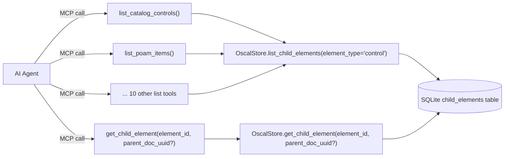

# Design Document: Query OSCAL Models — Child Element Tools

## Overview

This feature adds 13 new `@tool()` functions to `query_oscal_models.py`: 12 list tools that expose child element queries for each OSCAL model type, plus a single `get_child_element` tool for retrieving the full content of a specific element by its identifier.

Each list tool is a thin wrapper that delegates to the existing `OscalStore.list_child_elements()` method with a fixed `element_type` filter. The `get_child_element` tool delegates to a new `OscalStore.get_child_element()` method that returns the full `raw_json` for a single element.

A key design consideration is that OSCAL uses two identifier schemes:
- **UUIDs** (`UUIDDatatype`) — globally unique, used by most elements (tasks, activities, results, findings, poam-items, mappings, system-components)
- **Token IDs** (`TokenDatatype`) — human-readable (e.g. `ac-1`, `ac`), used by catalog controls and groups, unique only within the containing document

The `child_elements` table already handles this correctly with a `UNIQUE(uuid, parent_doc_id)` composite constraint, but the API response field is renamed from `uuid` to `id` to avoid implying all identifiers are UUIDs.

The list tools cover:
- Catalog: `list_catalog_controls`, `list_catalog_groups`
- SSP: `list_ssp_control_implementations`, `list_ssp_system_components`
- Profile: `list_profile_imports`, `list_profile_modify`
- Assessment Plan: `list_assessment_plan_tasks`, `list_assessment_plan_activities`
- Assessment Results: `list_assessment_results_results`, `list_assessment_results_findings`
- POA&M: `list_poam_items`
- Mapping Collection: `list_mapping_collection_mappings`

Component Definition child elements are excluded — they are already served by `query_component_definition.py`.

## Architecture

The architecture is a straightforward extension of the existing tool layer. No new modules or classes are introduced. One new store method (`get_child_element`) is added to `OscalStore`.



Each list tool function:
1. Calls `_get_store()` to obtain the `OscalStore` singleton.
2. Delegates to `store.list_child_elements(ctx, parent_doc_uuid, element_type=<fixed>, offset, limit)`.
3. Returns the Page_Response dict unchanged.

The `get_child_element` tool:
1. Calls `_get_store()` to obtain the `OscalStore` singleton.
2. Delegates to `store.get_child_element(element_id, parent_doc_uuid)`.
3. If `parent_doc_uuid` is provided, queries using the composite key `(uuid, parent_doc_id)`.
4. If `parent_doc_uuid` is omitted, queries by `uuid` alone — returns the element if exactly one match, returns an ambiguity error if multiple matches across documents.
5. Returns the full element dict including `raw_json`, or `null` if not found.

Registration follows the existing pattern: each function is imported in `tools/__init__.py` → `get_tool_list()` and added to the MCP server via `mcp.add_tool()` in `main.py::_setup_tools()`.

## Components and Interfaces

### New Tool Functions (in `query_oscal_models.py`)

All 12 list tools share an identical signature pattern:

```python
@tool()
def list_<model>_<element_type>(
    ctx: Context | None = None,
    parent_doc_uuid: str | None = None,
    offset: int = 0,
    limit: int = 10,
) -> dict:
    """Docstring describing the element type, parameters, and return format."""
    return _get_store().list_child_elements(
        ctx=ctx,
        parent_doc_uuid=parent_doc_uuid,
        element_type="<element-type>",
        offset=offset,
        limit=limit,
    )
```

| Tool Function | `element_type` value | Identifier Scheme |
|---|---|---|
| `list_catalog_controls` | `"control"` | Token ID (e.g. `ac-1`) — document-scoped |
| `list_catalog_groups` | `"group"` | Token ID (e.g. `ac`) — document-scoped, optional |
| `list_ssp_control_implementations` | `"control-implementation"` | Synthetic (`"control-implementation"`) — singleton |
| `list_ssp_system_components` | `"system-component"` | UUID — globally unique |
| `list_profile_imports` | `"import"` | Synthetic (`"import-{idx}"`) — positional |
| `list_profile_modify` | `"modify"` | Synthetic (`"modify"`) — singleton |
| `list_assessment_plan_tasks` | `"task"` | UUID — globally unique |
| `list_assessment_plan_activities` | `"activity"` | UUID — globally unique |
| `list_assessment_results_results` | `"result"` | UUID — globally unique |
| `list_assessment_results_findings` | `"finding"` | UUID — globally unique |
| `list_poam_items` | `"poam-item"` | UUID — globally unique (optional in schema) |
| `list_mapping_collection_mappings` | `"mapping"` | UUID — globally unique |

The `get_child_element` tool has a different signature:

```python
@tool()
def get_child_element(
    ctx: Context | None = None,
    element_id: str = "",
    parent_doc_uuid: str | None = None,
) -> dict | None:
    """Retrieve a single child element by its identifier.

    For elements with token-based IDs (catalog controls/groups),
    parent_doc_uuid should be provided to disambiguate since token IDs
    are only unique within their containing document.

    For elements with UUIDs, parent_doc_uuid is optional.

    Returns the full element including raw_json, or null if not found.
    Returns an error dict if the element_id is ambiguous across documents.
    """
    return _get_store().get_child_element(
        element_id=element_id,
        parent_doc_uuid=parent_doc_uuid,
    )
```

### Existing Components (modified)

- `OscalStore.list_child_elements()` — already implements filtering, pagination, lazy indexing, and the Page_Response envelope. The response item `uuid` key is renamed to `id` in the returned dicts.
- `OscalStore.get_child_element(element_id, parent_doc_uuid)` — **new method** that queries the `child_elements` table by `uuid` column (optionally scoped by parent document), returns the full element dict including `raw_json`, or handles ambiguity for token-based IDs.
- `_get_store()` / `init_store()` — module-level singleton management.
- `get_tool_list()` in `tools/__init__.py` — canonical tool registry.

### Design Decisions

1. **One function per element type** rather than a single generic `list_child_elements` tool with an `element_type` parameter. This gives AI agents discoverable, self-documenting tool names and avoids requiring them to know valid element type strings.

2. **Single generic `get_child_element` tool** rather than one get tool per element type. Unlike listing (where discoverability matters), getting by ID is a targeted lookup where the caller already knows what they want. A single tool avoids 12 nearly-identical get functions.

3. **`id` instead of `uuid` in response items.** OSCAL uses two identifier schemes: UUIDs for most elements, but human-readable token IDs (e.g. `ac-1`) for catalog controls and groups. The field is named `id` to accurately represent both. The `parentDocumentUuid` field is always included so callers can disambiguate token IDs that are only unique within their containing document.

4. **Ambiguity detection for token-based IDs.** When `get_child_element` is called without `parent_doc_uuid` and the `element_id` matches elements in multiple documents (e.g. `ac-1` exists in two different catalogs), the tool returns an error with the list of matching parent document UUIDs rather than silently returning the wrong element.

5. **No model-type scoping in the store call.** `list_child_elements()` filters by `element_type` which is already unique per model type (e.g. `"poam-item"` only appears under POA&M documents). Adding a redundant `model_type` filter would add complexity without benefit.

6. **Thin wrappers only.** The list tools contain no business logic — all filtering, pagination, and indexing is handled by `OscalStore`. This keeps the tool layer trivially testable and avoids duplicating store logic.

## Data Models

### Page_Response (existing, unchanged)

```python
{
    "items": list[dict],   # Page of results
    "total": int,          # Total matching count
    "offset": int,         # Requested offset
    "limit": int,          # Requested limit
    "hasMore": bool,       # True if more pages exist
}
```

### Child Element Item (list tools — response field renamed)

Each item in the `items` list returned by list tools:

```python
{
    "id": str,                      # Element identifier (UUID or token ID)
    "title": str,                   # Element title/name
    "element_type": str,            # e.g. "control", "finding", "poam-item"
    "description": str | None,      # Description or null
    "parentDocumentTitle": str,     # Title of the parent OSCAL document
    "parentDocumentUuid": str,      # UUID of the parent OSCAL document
}
```

The `id` field contains the element's native OSCAL identifier:
- For catalog controls: the human-readable `id` (e.g. `"ac-1"`, `"sc-7"`)
- For catalog groups: the human-readable `id` (e.g. `"ac"`, `"sc"`) or a synthetic ID if the group has no `id`
- For profile imports: a synthetic `"import-{idx}"` (positional)
- For profile modify / SSP control-implementation: a synthetic singleton ID
- For all other elements: a UUID

### Child Element Detail (get tool — includes raw_json)

Returned by `get_child_element`:

```python
{
    "id": str,                      # Element identifier (UUID or token ID)
    "title": str,                   # Element title/name
    "element_type": str,            # e.g. "control", "finding", "poam-item"
    "description": str | None,      # Description or null
    "parentDocumentTitle": str,     # Title of the parent OSCAL document
    "parentDocumentUuid": str,      # UUID of the parent OSCAL document
    "raw_json": str,                # Full serialized OSCAL element as JSON
}
```

### Ambiguity Error (get tool — token ID collision)

Returned when `element_id` matches multiple documents and `parent_doc_uuid` was not provided:

```python
{
    "error": "ambiguous_element_id",
    "message": str,                 # Human-readable explanation
    "element_id": str,              # The ambiguous ID
    "matching_documents": list[str] # List of parent document UUIDs
}
```

### OSCAL Identifier Scheme Reference

| Element Type | OSCAL Identifier | Datatype | Scope | Required |
|---|---|---|---|---|
| Catalog Control | `id` | TokenDatatype | Document-scoped | Yes |
| Catalog Group | `id` | TokenDatatype | Document-scoped | No |
| Profile Import | _(none)_ | Positional | N/A | N/A |
| Profile Modify | _(none)_ | Singleton | N/A | N/A |
| SSP control-implementation | _(none)_ | Singleton | N/A | N/A |
| SSP system-component | `uuid` | UUIDDatatype | Global | Yes |
| AP Task | `uuid` | UUIDDatatype | Global | Yes |
| AP Activity | `uuid` | UUIDDatatype | Global | Yes |
| AR Result | `uuid` | UUIDDatatype | Global | Yes |
| AR Finding | `uuid` | UUIDDatatype | Global | Yes |
| POA&M Item | `uuid` | UUIDDatatype | Global | No |
| Mapping | `uuid` | UUIDDatatype | Global | Yes |

The `child_elements` table uses `UNIQUE(uuid, parent_doc_id)` as its composite constraint, which correctly handles both globally-unique UUIDs and document-scoped token IDs without collisions.

## Correctness Properties

*A property is a characteristic or behavior that should hold true across all valid executions of a system — essentially, a formal statement about what the system should do. Properties serve as the bridge between human-readable specifications and machine-verifiable correctness guarantees.*

The 12 list tools are structurally identical — each is a thin wrapper that delegates to `OscalStore.list_child_elements()` with a fixed `element_type`. The `get_child_element` tool has distinct behavior around ambiguity detection. Properties are expressed as universal statements where applicable.

### Property 1: Correct delegation (list tools)

*For any* list child element tool and *for any* valid combination of `(parent_doc_uuid, offset, limit)` inputs, calling the tool SHALL delegate to `OscalStore.list_child_elements()` with the tool's designated `element_type` string and pass through `ctx`, `parent_doc_uuid`, `offset`, and `limit` unchanged, returning the store's result without modification.

**Validates: Requirements 1.1–1.4, 2.1–2.3, 3.1–3.3, 4.1–4.3, 5.1–5.3, 6.1–6.2, 7.1–7.2**

### Property 2: Consistent interface signature (list tools)

*For any* list child element tool in the set, the function SHALL accept parameters `ctx: Context | None = None`, `parent_doc_uuid: str | None = None`, `offset: int = 0`, `limit: int = 10` with the specified types and defaults, and SHALL have a non-empty docstring.

**Validates: Requirements 9.1, 9.2, 9.3, 9.5**

### Property 3: Response format contract (list tools)

*For any* list child element tool and *for any* valid inputs, the returned dict SHALL contain exactly the keys `{items, total, offset, limit, hasMore}`, and each item in `items` SHALL contain exactly the keys `{id, title, element_type, description, parentDocumentTitle, parentDocumentUuid}` where `description` is present (possibly `null`) rather than omitted.

**Validates: Requirements 9.4, 10.1, 10.2, 10.3, 10.4**

### Property 4: Store dependency enforcement

*For any* child element tool (list or get), calling it when the module-level `_store` is `None` SHALL raise `RuntimeError`.

**Validates: Requirements 9.6**

### Property 5: Get tool — unambiguous lookup

*For any* `(element_id, parent_doc_uuid)` pair where `parent_doc_uuid` is provided, `get_child_element` SHALL return at most one element matching the composite key `(element_id, parent_doc_uuid)`, or `null` if no match exists.

**Validates: Requirements 11.1, 11.2, 11.5, 11.6**

### Property 6: Get tool — ambiguity detection

*For any* `element_id` where `parent_doc_uuid` is omitted and the `element_id` matches child elements in more than one parent document, `get_child_element` SHALL return an error dict containing the list of matching parent document UUIDs rather than returning an arbitrary element.

**Validates: Requirements 11.3, 11.4**

## Error Handling

| Scenario | Behavior | Source |
|---|---|---|
| `_store` is `None` (not initialized) | `RuntimeError` raised by `_get_store()` | Existing `_get_store()` helper |
| `parent_doc_uuid` doesn't match any document | Page_Response with `total=0`, `items=[]` (list tools); `null` (get tool) | `OscalStore` |
| `offset` or `limit` out of range | Handled by store's SQL query (offset beyond total returns empty page) | `OscalStore.list_child_elements()` |
| Indexing failure for a parent document | Warning logged, query proceeds with whatever is already indexed | `OscalStore.list_child_elements()` |
| `get_child_element` with ambiguous token ID | Error dict with `error: "ambiguous_element_id"` and list of matching parent UUIDs | `OscalStore.get_child_element()` |
| `get_child_element` with empty `element_id` | `null` (no match) | `OscalStore.get_child_element()` |

No new error handling code is needed in the list tool functions themselves. The `get_child_element` tool delegates ambiguity detection to the store method.

## Testing Strategy

### Unit Tests (example-based)

- **Tool registration**: Verify `get_tool_list()` includes all 13 new tool functions (12 list + 1 get). (Req 8.1)
- **Empty results**: For each list tool, verify that calling it against an empty store returns `Page_Response` with `total=0` and `items=[]`. (Req 1.5, 2.4, 3.4, 4.4, 5.4, 6.3, 7.3)
- **Item format**: Verify list tool response items use `id` (not `uuid`) and include all required keys. (Req 10.1–10.4)
- **Get by UUID**: Ingest a document with UUID-identified elements, call `get_child_element` with the UUID, verify full element returned with `raw_json`. (Req 11.2, 11.5)
- **Get by token ID with parent**: Ingest a catalog, call `get_child_element(element_id="ac-1", parent_doc_uuid=<catalog_uuid>)`, verify correct control returned. (Req 11.2)
- **Get by token ID without parent — unique**: Ingest one catalog, call `get_child_element(element_id="ac-1")` without parent, verify it returns the element. (Req 11.3)
- **Get by token ID without parent — ambiguous**: Ingest two catalogs both containing `ac-1`, call `get_child_element(element_id="ac-1")` without parent, verify ambiguity error with both parent UUIDs. (Req 11.4)
- **Get not found**: Call `get_child_element(element_id="nonexistent")`, verify `null` returned. (Req 11.6)
- **Integration with real OSCAL data**: Using the existing `multi_type_store` fixture pattern, ingest sample OSCAL documents and verify each tool returns the expected child elements with correct metadata.

### Property-Based Tests (hypothesis)

Property-based tests validate the six correctness properties above. Each test runs a minimum of 100 iterations.

- **Library**: `hypothesis` (already in devtest dependencies)
- **Tag format**: `Feature: query-oscal-models, Property {N}: {title}`
- **Strategy**: Use `unittest.mock.patch` on `OscalStore.list_child_elements` and `OscalStore.get_child_element` to verify delegation parameters without needing real OSCAL data. Generate random `parent_doc_uuid` (UUIDs or None), `offset` (non-negative ints), and `limit` (1–100) values.

| Property | Test approach |
|---|---|
| Property 1: Correct delegation (list) | For each list tool, mock `list_child_elements`, call the tool with random params, assert the mock was called with the correct `element_type` and all params passed through. |
| Property 2: Consistent interface signature | Use `inspect.signature()` on each list tool to verify parameter names, types, and defaults. |
| Property 3: Response format contract | Call each list tool against a real `OscalStore` (with sample data), verify response dict keys and item dict keys use `id` not `uuid`. |
| Property 4: Store dependency enforcement | Set `_store = None`, call each tool (list and get), assert `RuntimeError`. |
| Property 5: Unambiguous lookup | Mock `get_child_element` store method, verify tool passes through `element_id` and `parent_doc_uuid` correctly. |
| Property 6: Ambiguity detection | Create two documents with overlapping token IDs, call `get_child_element` without parent, verify error dict returned. |

### Test Configuration

```python
from hypothesis import given, settings, strategies as st

@settings(max_examples=100)
@given(
    parent_doc_uuid=st.one_of(st.none(), st.uuids().map(str)),
    offset=st.integers(min_value=0, max_value=1000),
    limit=st.integers(min_value=1, max_value=100),
)
def test_delegation_property(parent_doc_uuid, offset, limit):
    ...
```
