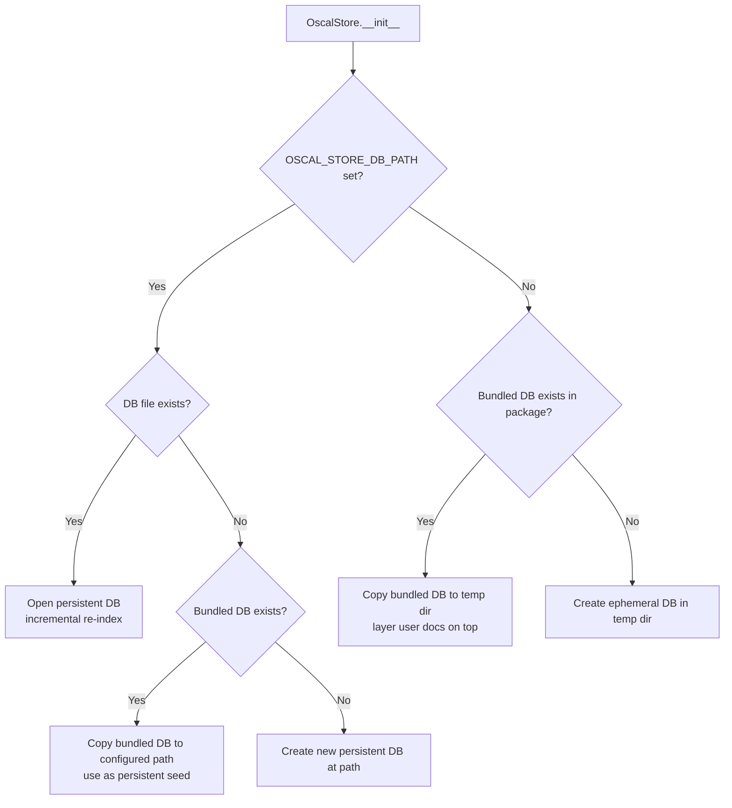
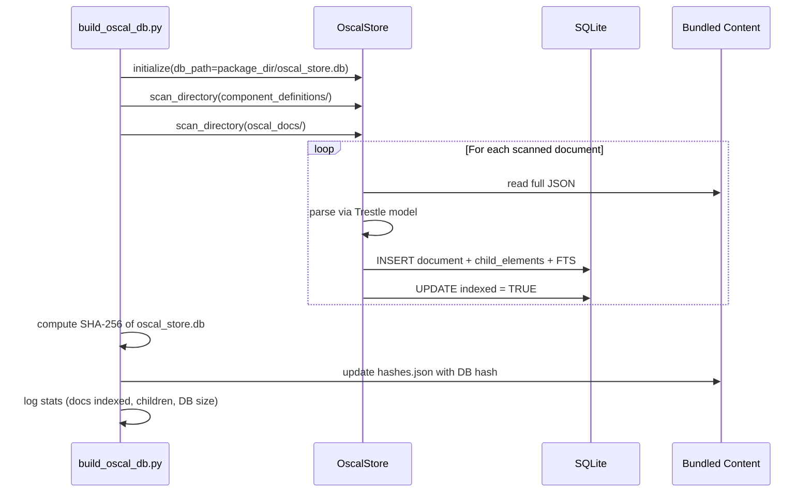
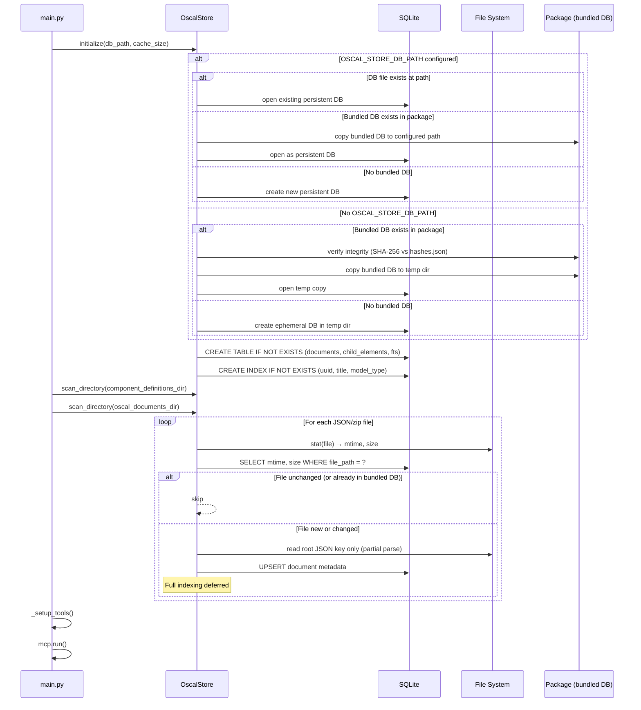
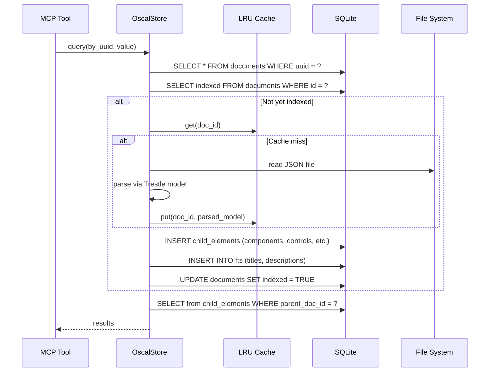

# Design Document: Scalable OSCAL Store

## Overview

This design replaces the in-memory `ComponentDefinitionStore` in `query_component_definition.py` with a SQLite-backed `OscalStore` that supports all eight OSCAL model types at scale (tens of thousands of documents). The current store eagerly loads every Component Definition into Python dicts at module import time, which is untenable at scale. The new store uses SQLite for persistence and indexing, defers full Trestle model parsing to query time via an LRU cache, and exposes a unified query interface while preserving backward compatibility with existing MCP tool signatures.

Key design decisions:
- **SQLite via Python stdlib `sqlite3`**: Zero external dependencies, ships with Python, supports FTS5, handles concurrent reads, and maps well to the point-lookup + filtered-scan query patterns this feature requires.
- **Three database modes**: (1) Pre-built bundled DB shipped with the package for instant startup, (2) persistent user-configured DB that survives restarts, (3) ephemeral temp DB as fallback. The bundled DB serves as a seed that can be layered with user content.
- **Lazy loading with LRU cache**: Directory scanning extracts only metadata (UUID, title, model type, file path, file size). Full Trestle model parsing happens on demand and is cached with configurable eviction.
- **Incremental re-indexing**: File modification timestamps and sizes are stored; only changed files are re-indexed on subsequent startups.
- **Unified query interface**: A single `query()` method works across all OSCAL model types, with an optional `oscal_model_type` parameter to scope queries.

## Architecture

```mermaid
graph TD
    subgraph MCP Tools Layer
        QCD[query_component_definition]
        LCD[list_component_definitions]
        LC[list_components]
        LCap[list_capabilities]
        GCap[get_capability]
        QCat[query_catalog]
        LCats[list_catalogs]
        QSSP[query_ssp]
        LSSP[list_ssps]
        NewTools[... other model tools]
    end

    subgraph OscalStore
        QI[query&#40;&#41;]
        LI[list_documents&#40;&#41;]
        LCE[list_child_elements&#40;&#41;]
        TS[text_search&#40;&#41;]
        ING[ingest&#40;&#41;]
        SCAN[scan_directory&#40;&#41;]
    end

    subgraph Storage Layer
        DB[(SQLite DB)]
        FTS[(FTS5 Virtual Table)]
        CACHE[LRU Cache<br/>parsed Trestle models]
        FS[File System<br/>OSCAL JSON files]
    end

    QCD --> QI
    LCD --> LI
    LC --> LCE
    LCap --> LCE
    GCap --> QI
    QCat --> QI
    LCats --> LI
    QSSP --> QI
    LSSP --> LI
    NewTools --> QI

    QI --> DB
    QI --> CACHE
    LI --> DB
    LCE --> DB
    TS --> FTS
    ING --> DB
    ING --> FTS
    SCAN --> FS
    SCAN --> ING
    CACHE --> FS
```



The architecture has three layers:

1. **MCP Tools Layer**: Thin wrappers that delegate to `OscalStore`. Existing tools (`query_component_definition`, `list_component_definitions`, etc.) are preserved with identical signatures. New tools for other model types follow the same conventions.

2. **OscalStore**: The core class that owns the SQLite connection, manages the LRU cache, and provides the unified query/list/search API. It replaces `ComponentDefinitionStore`.

3. **Storage Layer**: SQLite database for metadata and indexes, FTS5 virtual table for text search, LRU cache for parsed Trestle models, and the file system for raw OSCAL JSON.

### Database Modes

The store supports three modes, resolved at initialization:



- **Bundled mode** (default when no config): The package ships a pre-built `oscal_store.db` alongside the bundled JSON/zip content. At startup, it's copied to a temp location (or to `OSCAL_STORE_DB_PATH` if configured but empty) and used as a seed. All bundled content is already fully indexed — zero startup cost.
- **Persistent mode** (`OSCAL_STORE_DB_PATH` set): The DB at that path is reused across restarts. Incremental re-indexing handles file changes. User-added documents accumulate over time.
- **Ephemeral mode** (no config, no bundled DB): A temp DB is created and populated from scratch each run. This is the simplest fallback.

### Build Script for Bundled Database

A build script (`bin/build_oscal_db.py`, exposed as `hatch run build-db`) generates the bundled database:



The build script differs from runtime scanning in that it fully indexes everything eagerly (no lazy loading) so the shipped DB is complete. The resulting `oscal_store.db` is included in `pyproject.toml` package data and verified at startup via the existing `hashes.json` integrity pattern.

### Startup Sequence



### Query-Time Lazy Indexing

When a query needs child elements for a document that hasn't been fully indexed yet:



## Components and Interfaces

### OscalStore (replaces ComponentDefinitionStore)

```python
class OscalStore:
    """SQLite-backed store for all OSCAL model types."""

    def __init__(self, db_path: str | None = None, cache_size: int = 100) -> None:
        """Initialize the store, resolving database mode.

        Resolution order:
        1. If db_path is set and file exists → open persistent DB
        2. If db_path is set and file missing → copy bundled DB (if exists) or create new
        3. If db_path is None and bundled DB exists → copy to temp, verify integrity
        4. If db_path is None and no bundled DB → create ephemeral in temp dir

        Args:
            db_path: Path to SQLite database file. None = auto-resolve.
            cache_size: Max number of parsed Trestle models to cache.

        Raises:
            RuntimeError: If the database cannot be created or opened.
        """

    def scan_directory(self, directory: Path, model_type_filter: OSCALModelType | None = None) -> int:
        """Scan a directory for OSCAL JSON files, extracting metadata only.

        Returns the number of new/updated files found.
        Handles missing/empty directories gracefully (logs info, returns 0).
        Also processes .zip files for backward compatibility.
        """

    def query(
        self,
        ctx: Context | None = None,
        oscal_model_type: OSCALModelType | None = None,
        query_type: Literal["all", "by_uuid", "by_title", "by_type"] = "all",
        query_value: str | None = None,
        offset: int = 0,
        limit: int = 10,
    ) -> dict:
        """Unified query across all OSCAL model types.

        Args:
            oscal_model_type: Scope to a specific model type, or None for all.
            query_type: "by_uuid" (O(log n) index lookup), "by_title"
                (case-insensitive exact then FTS fallback), "by_type",
                or "all" (paginated).
            query_value: Required for by_uuid, by_title, by_type.
            offset/limit: Pagination parameters.

        Returns:
            Page_Response dict with items, total, offset, limit, hasMore.

        Raises:
            ValueError: If query_value missing when required.
        """

    def list_documents(
        self,
        ctx: Context | None = None,
        oscal_model_type: OSCALModelType | None = None,
        offset: int = 0,
        limit: int = 10,
    ) -> dict:
        """List document summaries (UUID, title, model_type, child_count, sizeInBytes).

        Reads directly from SQLite — no full document loading.
        Returns Page_Response dict.
        """

    def list_child_elements(
        self,
        ctx: Context | None = None,
        parent_doc_uuid: str | None = None,
        element_type: str | None = None,
        offset: int = 0,
        limit: int = 10,
    ) -> dict:
        """List child element summaries with parent document info.

        Returns Page_Response dict.
        """

    def text_search(
        self,
        query_text: str,
        oscal_model_type: OSCALModelType | None = None,
        offset: int = 0,
        limit: int = 10,
    ) -> dict:
        """FTS5 full-text search across documents and child elements.

        Returns Page_Response dict with results ranked by relevance.
        """

    def get_parsed_model(self, doc_id: int) -> object:
        """Get a fully parsed Trestle model, using LRU cache.

        Triggers lazy indexing of child elements if not yet done.
        """

    def load_external_component_definition(self, source: str, ctx: Context | None) -> None:
        """Backward-compatible: load from URI (local zip or remote JSON)."""

    def _ensure_indexed(self, doc_id: int) -> None:
        """Ensure a document's child elements are indexed. No-op if already done."""

    def _detect_model_type(self, file_path: Path) -> OSCALModelType | None:
        """Read only the first root key from a JSON file to detect model type."""

    def _extract_child_elements(self, model_type: OSCALModelType, parsed_model: object) -> list[dict]:
        """Extract child element metadata from a parsed Trestle model.

        Maps model type to child extraction logic:
        - component-definition → components, capabilities
        - catalog → controls, groups
        - profile → imports, modifications
        - ssp → control-implementations
        - mapping-collection → mappings
        - assessment-plan → tasks, activities
        - assessment-results → results, findings
        - poam → poam-items
        """
```

### Child Element Type Mapping

| OSCAL Model Type | Child Element Types |
|---|---|
| component-definition | component, capability |
| catalog | control, group |
| profile | import, modify |
| system-security-plan | control-implementation, system-component |
| assessment-plan | task, activity |
| assessment-results | result, finding |
| plan-of-action-and-milestones | poam-item |
| mapping-collection | mapping |

### Trestle Model Mapping

Each `OSCALModelType` maps to a `trestle.oscal.*` Pydantic model for parsing and validation:

| OSCALModelType | Trestle Module | Root Class |
|---|---|---|
| catalog | `trestle.oscal.catalog` | `Catalog` |
| profile | `trestle.oscal.profile` | `Profile` |
| component-definition | `trestle.oscal.component` | `ComponentDefinition` |
| system-security-plan | `trestle.oscal.ssp` | `SystemSecurityPlan` |
| assessment-plan | `trestle.oscal.ap` | `AssessmentPlan` |
| assessment-results | `trestle.oscal.ar` | `AssessmentResults` |
| plan-of-action-and-milestones | `trestle.oscal.poam` | `PlanOfActionAndMilestones` |
| mapping-collection | `trestle.oscal.mapping` | `MappingCollection` |

### Config Additions

```python
# In Config.__init__():
self.oscal_store_db_path: str = os.getenv("OSCAL_STORE_DB_PATH", "")
# When empty: use bundled DB if available, else ephemeral temp dir
# When set: persistent DB at this path (survives restarts)
self.oscal_store_cache_size: int = int(os.getenv("OSCAL_STORE_CACHE_SIZE", "100"))
self.oscal_documents_dir: str = os.getenv("OSCAL_DOCUMENTS_DIR", "")
```

### Bundled Database Location

```python
# Path to the pre-built DB shipped with the package
BUNDLED_DB_PATH = Path(__file__).parent / "oscal_store.db"
```

The bundled DB sits alongside the other bundled content directories (`oscal_schemas/`, `oscal_docs/`, `component_definitions/`). Its hash is recorded in a `hashes.json` at the package root level and verified at startup using the existing `verify_package_integrity` pattern.

### Backward-Compatible MCP Tool Wrappers

Existing tools delegate to `OscalStore` with model-type scoping:

```python
# query_component_definition delegates to:
_store.query(oscal_model_type=OSCALModelType.COMPONENT_DEFINITION, ...)

# list_component_definitions delegates to:
_store.list_documents(oscal_model_type=OSCALModelType.COMPONENT_DEFINITION, ...)

# list_components delegates to:
_store.list_child_elements(element_type="component", ...)

# list_capabilities delegates to:
_store.list_child_elements(element_type="capability", ...)
```

New tools follow the same pattern:

```python
@tool()
def query_catalog(ctx, query_type="all", query_value=None, offset=0, limit=10) -> dict:
    return _store.query(oscal_model_type=OSCALModelType.CATALOG, ...)

@tool()
def list_catalogs(ctx, offset=0, limit=10) -> dict:
    return _store.list_documents(oscal_model_type=OSCALModelType.CATALOG, ...)
```

## Data Models

### SQLite Schema

```sql
-- Core document metadata table
CREATE TABLE IF NOT EXISTS documents (
    id          INTEGER PRIMARY KEY AUTOINCREMENT,
    uuid        TEXT NOT NULL UNIQUE,
    title       TEXT NOT NULL,
    model_type  TEXT NOT NULL,  -- OSCALModelType value e.g. 'catalog', 'component-definition'
    file_path   TEXT NOT NULL UNIQUE,
    file_size   INTEGER NOT NULL,  -- bytes
    file_mtime  REAL NOT NULL,     -- os.path.getmtime() float
    raw_json    TEXT NOT NULL,      -- full JSON content for lazy parsing
    indexed     INTEGER NOT NULL DEFAULT 0,  -- 0=metadata only, 1=child elements extracted
    created_at  TEXT NOT NULL DEFAULT (datetime('now')),
    updated_at  TEXT NOT NULL DEFAULT (datetime('now'))
);

CREATE INDEX IF NOT EXISTS idx_documents_uuid ON documents(uuid);
CREATE INDEX IF NOT EXISTS idx_documents_title ON documents(title COLLATE NOCASE);
CREATE INDEX IF NOT EXISTS idx_documents_model_type ON documents(model_type);

-- Child elements table (components, controls, capabilities, etc.)
CREATE TABLE IF NOT EXISTS child_elements (
    id              INTEGER PRIMARY KEY AUTOINCREMENT,
    uuid            TEXT NOT NULL,
    title           TEXT NOT NULL,  -- title or name depending on element type
    element_type    TEXT NOT NULL,  -- 'component', 'capability', 'control', 'group', etc.
    parent_doc_id   INTEGER NOT NULL REFERENCES documents(id) ON DELETE CASCADE,
    description     TEXT,           -- optional description for FTS
    raw_json        TEXT,           -- serialized element JSON for direct retrieval
    UNIQUE(uuid, parent_doc_id)
);

CREATE INDEX IF NOT EXISTS idx_child_uuid ON child_elements(uuid);
CREATE INDEX IF NOT EXISTS idx_child_title ON child_elements(title COLLATE NOCASE);
CREATE INDEX IF NOT EXISTS idx_child_type ON child_elements(element_type);
CREATE INDEX IF NOT EXISTS idx_child_parent ON child_elements(parent_doc_id);

-- FTS5 virtual table for full-text search
CREATE VIRTUAL TABLE IF NOT EXISTS fts_index USING fts5(
    entity_type,    -- 'document' or 'child_element'
    entity_id,      -- references documents.id or child_elements.id
    title,
    description,
    model_type,     -- for scoped search
    content=''      -- external content mode (we manage inserts ourselves)
);
```

### Key Design Choices for the Schema

1. **`raw_json` in `documents`**: Stores the full JSON so that lazy parsing can happen without re-reading the file system. This trades disk space for query-time reliability (files could be moved/deleted after scan).

2. **`raw_json` in `child_elements`**: Stores the serialized child element so that simple lookups (by UUID) can return data without parsing the entire parent document.

3. **`indexed` flag**: Tracks whether child elements have been extracted. Scanning sets this to 0; full indexing sets it to 1. This enables the lazy indexing pattern.

4. **`file_mtime` + `file_size`**: Used for change detection. On re-scan, if both match, the file is skipped. This avoids expensive hash computation.

5. **FTS5 external content mode**: We manage inserts into the FTS table ourselves during indexing, rather than mirroring a content table. This gives us control over what text gets indexed.

6. **`UNIQUE(uuid, parent_doc_id)` on child_elements**: A child element UUID is unique within a parent document but could theoretically appear in multiple documents (e.g., shared components). The compound unique constraint handles this.

### LRU Cache

```python
from functools import lru_cache

# Wrapped in a method so cache_size is configurable
@lru_cache(maxsize=config.oscal_store_cache_size)
def _parse_model(doc_id: int, raw_json: str, model_type: str) -> object:
    """Parse raw JSON into a Trestle model. Cached by doc_id."""
```

The cache key is `doc_id` (stable integer PK). When a file changes and is re-ingested, it gets a new `raw_json` value, which naturally invalidates the cache entry since the arguments differ.


## Correctness Properties

*A property is a characteristic or behavior that should hold true across all valid executions of a system — essentially, a formal statement about what the system should do. Properties serve as the bridge between human-readable specifications and machine-verifiable correctness guarantees.*

### Property 1: Document metadata persistence round-trip

*For any* valid OSCAL document (of any model type) with a UUID, title, model type, file path, and file size, ingesting it into the OscalStore and then querying the document back by UUID should return metadata where UUID, title, model_type, file_path, and sizeInBytes all match the original values.

**Validates: Requirements 1.1, 4.1**

### Property 2: Child element metadata persistence

*For any* valid OSCAL document that contains child elements (components, controls, capabilities, etc.), after the document is fully indexed, querying child_elements by parent document ID should return elements whose UUID, title, and element_type match the child elements in the original document, and each child element's parent_doc_id should reference a valid document row.

**Validates: Requirements 1.4**

### Property 3: Model type detection and multi-model acceptance

*For any* valid OSCAL JSON document whose root key is one of the keys in `ROOT_KEY_TO_MODEL_TYPE`, the OscalStore's model type detection should return the `OSCALModelType` value corresponding to that root key, and the document should be successfully ingested and queryable.

**Validates: Requirements 2.1, 2.2**

### Property 4: Child element type correctness per model type

*For any* valid OSCAL document of a given model type, after full indexing, the `element_type` values of its child elements in the database should be a subset of the expected child element types for that model type (e.g., component-definition → {component, capability}, catalog → {control, group}).

**Validates: Requirements 2.5**

### Property 5: Model type filtering

*For any* set of ingested OSCAL documents of mixed model types, listing or querying with an `oscal_model_type` filter should return only documents whose model_type matches the filter, and the count should equal the number of ingested documents of that type.

**Validates: Requirements 2.6, 5.1**

### Property 6: Incremental re-indexing

*For any* set of ingested OSCAL documents, if the store is re-initialized with the same database and the files on disk have not changed (same mtime and size), then re-scanning should result in zero files being re-processed, and all previously indexed data should remain intact and queryable.

**Validates: Requirements 3.4, 3.5, 9.5**

### Property 7: Pagination correctness

*For any* list of N ingested documents and any valid offset (0 ≤ offset ≤ N) and limit (1 ≤ limit ≤ 100), the Page_Response returned by list_documents should satisfy: `len(items) == min(limit, N - offset)`, `total == N`, `hasMore == (offset + limit < N)`, and the items should be the correct slice of the full ordered list.

**Validates: Requirements 4.3**

### Property 8: Child element listings include parent info

*For any* child element returned by list_child_elements, the result should include `parentDocumentTitle` and `parentDocumentUuid` fields, and these should match the title and UUID of the parent document in the documents table.

**Validates: Requirements 4.4**

### Property 9: UUID lookup returns exact match

*For any* document or child element with a known UUID in the store, querying with `query_type="by_uuid"` and that UUID as `query_value` should return exactly one result whose UUID matches the query value.

**Validates: Requirements 5.3**

### Property 10: Case-insensitive title search

*For any* document with a known title, querying with `query_type="by_title"` using any case variation of that title (upper, lower, mixed) should return a result matching that document.

**Validates: Requirements 5.4**

### Property 11: Full-text search relevance with model type scoping

*For any* indexed document or child element whose title or description contains a given term, a text search for that term should include that entity in the results. When the search is scoped to a specific `oscal_model_type`, only entities of that model type should appear in the results.

**Validates: Requirements 6.2, 6.3**

### Property 12: Backward-compatible return format for component definition queries

*For any* valid component definition query that would succeed against the current `ComponentDefinitionStore`, the same query against the new `OscalStore` (via the existing MCP tool wrappers) should return a result dict containing the same top-level keys (`components`, `total_count`, `query_type`, `component_definitions_searched`, `filtered_by` for component queries; `items`, `total`, `offset`, `limit`, `hasMore` for list operations).

**Validates: Requirements 7.2**

### Property 13: Bundled database completeness

*For any* OSCAL document present in the bundled content directories at build time, the Bundled_Database should contain a fully indexed entry (document metadata, all child elements, FTS entries) for that document. Opening the Bundled_Database without any directory scanning should allow querying all bundled content immediately.

**Validates: Requirements 10.1, 10.2**

### Property 14: Database mode resolution

*For any* combination of `OSCAL_STORE_DB_PATH` (set or unset) and bundled DB presence (exists or not), the OscalStore should initialize successfully and resolve to exactly one of the three database modes (bundled, persistent, ephemeral). The resolved mode should be deterministic given the same inputs.

**Validates: Requirements 1.2, 1.3, 1.4, 1.5**

## Error Handling

| Scenario | Behavior |
|---|---|
| SQLite DB cannot be created/opened | Raise `RuntimeError` with path and OS error details during `__init__` |
| DB write fails (INSERT/UPDATE) | Log error, raise descriptive exception, existing data untouched (SQLite transaction rollback) |
| Document fails Trestle validation | Log warning with file path + error, skip document, continue processing |
| Invalid JSON file in directory | Log debug, skip file, continue processing |
| `query_value` missing for by_uuid/by_title/by_type | Raise `ValueError` with descriptive message |
| UUID/title not found in query | Return empty result set (no exception), consistent with current behavior |
| Documents directory does not exist | Log info, return empty store, no exception |
| Documents directory is empty | Log info, return empty store, no exception |
| File read error during lazy parsing | Log error, raise `RuntimeError`, cache not populated |
| FTS query syntax error | Catch `sqlite3.OperationalError`, fall back to LIKE query, log warning |
| LRU cache miss for evicted model | Re-parse from `raw_json` stored in SQLite (no file system dependency) |
| Zip file contains invalid entries | Log debug per invalid entry, continue processing valid entries |
| Remote URI fetch fails | Raise `ValueError` with descriptive message (preserves current behavior) |
| Bundled DB fails integrity check | Log warning, fall back to ephemeral DB built from bundled JSON/zip files |
| Bundled DB copy to temp/persistent path fails | Log error, fall back to creating fresh DB at target path |

All database mutations use explicit transactions. On failure, `sqlite3` rolls back automatically, preserving data integrity (Requirement 1.6).

## Testing Strategy

### Unit Tests (example-based)

Unit tests cover specific scenarios, edge cases, configuration, and error conditions:

- **Schema initialization**: Verify all tables, indexes, and FTS virtual table exist after `__init__` (Req 1.3, 1.5)
- **Configuration**: Verify `OSCAL_STORE_DB_PATH`, `OSCAL_STORE_CACHE_SIZE`, `OSCAL_DOCUMENTS_DIR` env vars are read correctly (Req 8.1–8.4)
- **Lazy loading**: Verify `indexed=0` after scan, `indexed=1` after query triggers parsing (Req 3.1, 3.2)
- **LRU cache eviction**: Configure cache_size=2, parse 3 docs, verify first evicted (Req 3.3)
- **Error handling**: Missing query_value raises ValueError, missing directory starts empty, DB creation failure raises RuntimeError (Req 5.6, 9.1, 9.2, 9.4)
- **Validation skip**: Mix valid and invalid documents, verify only valid ones indexed (Req 2.3, 2.4)
- **Backward compatibility**: Call existing tools with same parameters as current tests, verify same return format and keys (Req 7.1, 7.3)
- **External loading**: Load from local zip and mocked remote URI (Req 7.4)
- **FTS setup**: Verify FTS5 table exists and is populated after indexing (Req 6.1)
- **Search response format**: Verify text_search returns Page_Response envelope (Req 6.4)
- **Startup ordering**: Verify scan completes before server accepts connections (Req 9.3)
- **Bundled DB startup**: Verify bundled DB is detected, copied, and used without scanning (Req 9.6, 10.1)
- **Bundled DB integrity failure**: Verify fallback to ephemeral when bundled DB hash mismatches (Req 10.5)
- **Database mode resolution**: Verify correct mode for each combination of OSCAL_STORE_DB_PATH and bundled DB presence (Req 1.2–1.5)
- **Persistent DB reuse**: Verify DB at configured path survives simulated restart (Req 8.1, 9.5)
- **Bundled DB seeding**: Verify bundled DB is copied to OSCAL_STORE_DB_PATH when path configured but file missing (Req 9.7)
- **Build script idempotency**: Run build script twice, verify identical logical content (Req 10.2)

### Property-Based Tests (Hypothesis)

Property-based tests verify universal correctness properties across generated inputs. Each test runs a minimum of 100 iterations using the `hypothesis` library (already in devtest dependencies).

Each property test is tagged with a comment referencing its design property:

```python
# Feature: scalable-oscal-store, Property 1: Document metadata persistence round-trip
@given(st.text(min_size=1), st.sampled_from(list(OSCALModelType)))
@settings(max_examples=100)
def test_document_metadata_round_trip(title, model_type):
    ...
```

Properties to implement as PBT:

| Property | Test Description |
|---|---|
| P1 | Generate random document metadata, ingest, query back, verify all fields match |
| P2 | Generate documents with random child elements, index, verify child metadata and FK integrity |
| P3 | Generate JSON with random valid root keys, verify model type detection matches ROOT_KEY_TO_MODEL_TYPE |
| P4 | Generate documents of each model type, index, verify child element_types are in expected set |
| P5 | Generate mixed-type document sets, filter by each type, verify only matching docs returned |
| P6 | Ingest documents, re-scan unchanged files, verify zero re-processing |
| P7 | Generate N documents, test with random offset/limit, verify Page_Response invariants |
| P8 | Generate documents with children, list children, verify parent info present and correct |
| P9 | Generate documents with known UUIDs, query each by UUID, verify exact match |
| P10 | Generate documents with known titles, query with random case variations, verify match |
| P11 | Generate documents with known text in titles/descriptions, search for terms, verify found; scope by type, verify filtering |
| P12 | Generate component definition queries, run against new store, verify return format keys match expected schema |
| P13 | Build bundled DB from test fixtures, open without scanning, verify all bundled docs queryable with children and FTS |
| P14 | Generate all 4 combinations of DB_PATH × bundled DB presence, verify each resolves to correct mode |

### Test Infrastructure

- **Hypothesis strategies**: Custom strategies for generating valid OSCAL document metadata (UUIDs, titles, model types) and minimal valid JSON structures for each model type.
- **Fixtures**: Temporary SQLite databases (via `tmp_path`), temporary directories with generated OSCAL JSON files.
- **Existing fixtures**: Reuse `tests/fixtures/sample_component_definition.json` and `sample_component_definition_with_capabilities.json` for backward compatibility tests.
- **Markers**: Property tests marked with `@pytest.mark.slow` since they run 100+ iterations.
